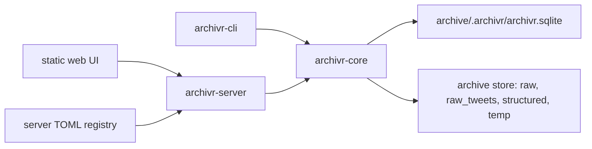
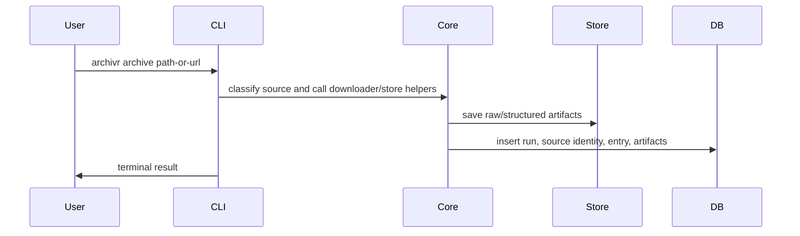
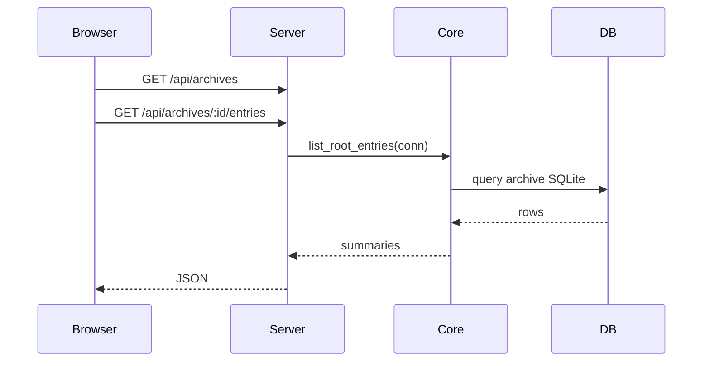

# Archivr Mental Model

This document explains the current project shape after the workspace refactor.

## Key Documents

| Document | Role |
|---|---|
| `ARCHIVR-MENTAL-MODEL.md` | **This file.** Current architecture, data flows, and where to edit. |
| `docs/README.md` | User-facing docs: how to run the tool, supported inputs, environment variables. |

## The Big Model

Archivr is now a Rust workspace with three crates:



The key rule:

> `archivr-core` owns archive behavior. `archivr-cli` and `archivr-server` are adapters.

## Crates

| Crate | Responsibility |
|---|---|
| `archivr-core` | Archive/domain logic, database schema, queries, download/store helpers |
| `archivr-cli` | Command-line interface, argument parsing, terminal behavior |
| `archivr-server` | Web server, API routes, mounted archive registry, static UI |

## Archive Model

Each archive is still self-contained:

```text
some-archive/
  .archivr/
    archivr.sqlite
    name
    store_path
store/
  raw/
  raw_tweets/
  structured/
  temp/
```

The web server can mount many independent archives through its own TOML registry.
That registry is separate from the archives themselves.

Example:

```toml
[[archives]]
id = "personal"
label = "Personal"
archive_path = "/path/to/archive/.archivr"
```

## Entry Nesting

Entries support a two-level parent/child hierarchy. A **container entry** (playlist or channel) holds zero or more child entries (individual videos). Container entries have no primary media artifact of their own; their `total_artifact_bytes` is the sum of their children's bytes.

Rules:
- Maximum nesting depth is 2 (root → child). Children cannot have children.
- The UI shows child entries collapsed under their parent, expandable with a chevron.
- Container entries are created by playlist/channel captures. Single-video and all other source types produce a standalone root entry with no children.

If a feature touches how entries are parented or how the UI groups them, start in `archivr-core` (`database.rs` for schema, `archive.rs` for listing, `capture.rs` for creation).

## How To Run It

There are two user-facing binaries:

| Binary | Purpose |
|---|---|
| `archivr` | CLI for initializing archives and capturing material into one archive |
| `archivr-server` | Web server for browsing one or more existing archives |

The CLI writes archive data:

```sh
nix run .#archivr -- init ./my-archive --name "My Archive"
nix run .#archivr -- archive file:///absolute/path/to/file.pdf
```

The server reads archive data:

```sh
nix run .#archivr-server -- ./archivr-server.toml
```

If no config path is passed, the server reads `./archivr-server.toml`.
The config is a server registry, not archive data:

```toml
[[archives]]
id = "personal"
label = "Personal"
archive_path = "/absolute/path/to/my-archive/.archivr"
```

The packaged Nix server wrapper sets `ARCHIVR_STATIC_DIR` so the server can find the installed web UI assets. Source-tree runs do not need that variable because they fall back to `crates/archivr-server/static`.

## Write Data Flow

When archiving something through the CLI:



## Web Capture Pipeline

Web pages (`Source::WebPage`) take a longer path than yt-dlp or tweets:

1. **Fetch URL selection.** If `via_freedium` is set and the locator isn't already a Freedium URL, the downloader fetches the page through `freedium-mirror.cfd` with no forwarded cookies. The canonical DB URL stays the original locator.
2. **Browser capture.** `downloader/singlefile.rs` shells out to `single-file-cli` driving headless Chromium. Extensions (uBlock, cookie-consent) and injected browser scripts (modal closer, reader mode) attach per `CaptureConfig`.
3. **Reader mode** (optional) concatenates Mozilla's `Readability.js` from `vendor/readability/` into the SingleFile browser script and stamps absolute URLs on lazy images so the serialised DOM points to fetchable sources.
4. **Freedium cleanup** strips mirror UI (nav, footer, toaster, author header, download control) using multi-signal selectors so article-authored controls aren't hit.
5. **Rust post-processing.** After SingleFile writes the HTML, a Rust pass fetches any images the browser couldn't inline (bounded reads, same-origin cookie forwarding) and embeds them as data URIs. Title extraction runs after embedded font blocks are stripped so large fonts don't push `<title>` beyond the read window.

## Read Data Flow

When opening the web UI:



## Where To Edit

| Feature kind | Edit here |
|---|---|
| DB schema, inserts, archive runs, entries, tags | `crates/archivr-core/src/database.rs` |
| Capture orchestration, `Source` routing, `CaptureConfig` | `crates/archivr-core/src/capture.rs` |
| Archive opening, listing entries, entry detail, runs | `crates/archivr-core/src/archive.rs` |
| Download/save behavior | `crates/archivr-core/src/downloader/` |
| YouTube playlist/channel download, playlist probe, sync mode | `crates/archivr-core/src/downloader/ytdlp.rs` and `capture.rs` |
| CLI commands, argument parsing, terminal output | `crates/archivr-cli/src/main.rs` |
| Server API routes | `crates/archivr-server/src/routes.rs` |
| Auth model (users, sessions, tokens, roles) | `crates/archivr-server/src/auth.rs` |
| Mounted archive config model | `crates/archivr-server/src/registry.rs` |
| Frontend root state + routing | `frontend/src/App.jsx` |
| Frontend API client | `frontend/src/api.js` |
| Frontend components | `frontend/src/components/` |
| Frontend styling | `frontend/src/styles.css` |

## Practical Feature Rule

If a feature affects archive truth, start in `archivr-core`.

If a feature is only how the terminal behaves, edit `archivr-cli`.

If a feature is only how the browser sees or calls things, edit `archivr-server` and the static UI.

If a browser feature needs new data, the usual order is:

1. Add or query the data in `archivr-core`.
2. Expose it in `archivr-server`.
3. Render it in the static UI.

## Server Capabilities

The server both reads and writes archive data. Capture jobs are asynchronous: `POST /api/archives/:id/captures` inserts a job row, spawns a blocking task, and returns immediately; the frontend polls until the job completes or fails. Heavy work stays synchronous inside `archivr-core`.

**Auth model.** A separate `archivr-auth.sqlite` (path derived from the server config directory) holds users, sessions, and API tokens. Role bits are `u32` flags (`GUEST`, `USER`, `ADMIN`, `OWNER`) so a single bitmask value covers assignment, checks, and visibility. The middleware stack is `setup_guard` → `login_rate_limit` → `security_headers`; route families are classified `READ / ADMIN / WRITE / STATIC` in `routes.rs`.

**Search** is client-side filtering over entries the frontend has already fetched.

**Admin view** covers mounted archives, users, sessions, and API tokens.

