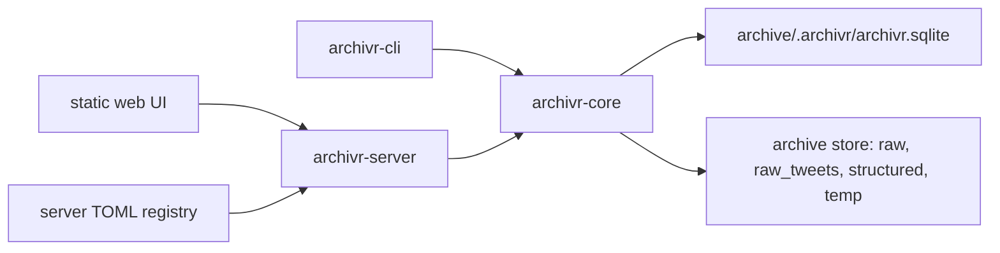
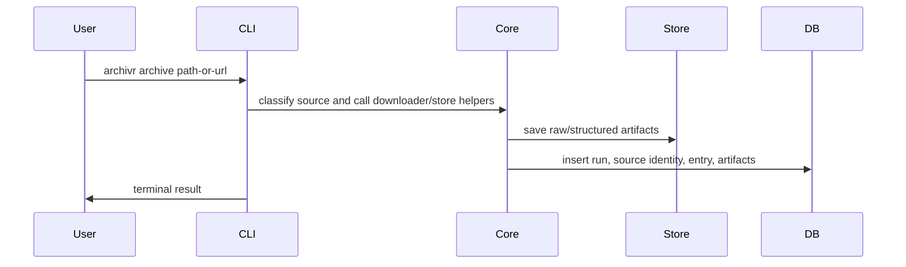
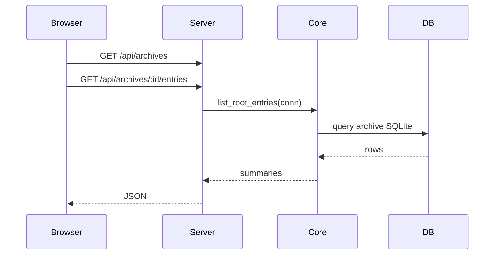

# Archivr Mental Model

This document explains the current project shape after the workspace refactor.

## The Big Model

Archivr is now a Rust workspace with three crates:



The key rule:

> `archivr-core` owns archive behavior. `archivr-cli` and `archivr-server` are adapters.

## Crates

| Crate | Responsibility |
|---|---|
| `archivr-core` | Archive/domain logic, database schema, queries, download/store helpers |
| `archivr-cli` | Command-line interface, argument parsing, terminal behavior |
| `archivr-server` | Web server, API routes, mounted archive registry, static UI |

## Archive Model

Each archive is still self-contained:

```text
some-archive/
  .archivr/
    archivr.sqlite
    name
    store_path
store/
  raw/
  raw_tweets/
  structured/
  temp/
```

The web server can mount many independent archives through its own TOML registry.
That registry is separate from the archives themselves.

Example:

```toml
[[archives]]
id = "personal"
label = "Personal"
archive_path = "/path/to/archive/.archivr"
```

## Write Data Flow

When archiving something through the CLI:



## Read Data Flow

When opening the web UI:



## Where To Edit

| Feature kind | Edit here |
|---|---|
| DB schema, inserts, archive runs, entries, tags | `crates/archivr-core/src/database.rs` |
| Archive opening, listing entries, entry detail, runs | `crates/archivr-core/src/archive.rs` |
| Download/save behavior | `crates/archivr-core/src/downloader/` |
| CLI commands, argument parsing, terminal output | `crates/archivr-cli/src/main.rs` |
| Server API routes | `crates/archivr-server/src/routes.rs` |
| Mounted archive config model | `crates/archivr-server/src/registry.rs` |
| Browser UI behavior | `crates/archivr-server/static/app.js` |
| Browser UI layout | `crates/archivr-server/static/index.html` |
| Browser UI styling | `crates/archivr-server/static/styles.css` |

## Practical Feature Rule

If a feature affects archive truth, start in `archivr-core`.

If a feature is only how the terminal behaves, edit `archivr-cli`.

If a feature is only how the browser sees or calls things, edit `archivr-server` and the static UI.

If a browser feature needs new data, the usual order is:

1. Add or query the data in `archivr-core`.
2. Expose it in `archivr-server`.
3. Render it in the static UI.

## Current Limitations

The web server reads archive data and serves the UI. It does not yet implement capture.

Search is currently simple client-side filtering.

Auth is not a production model yet.

Admin is a mounted-archives view, not a management system.
