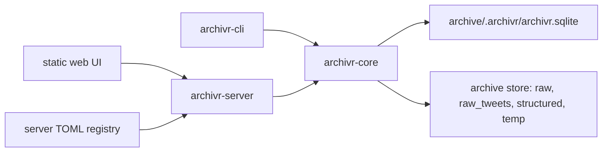
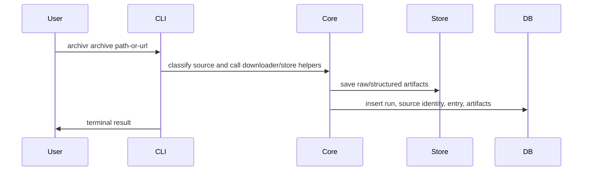
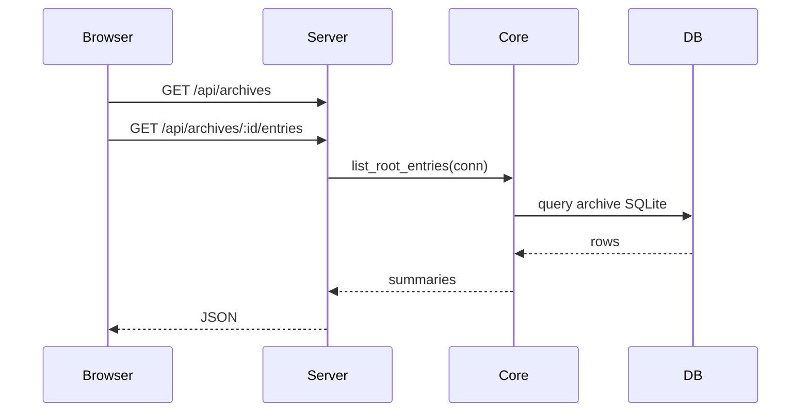
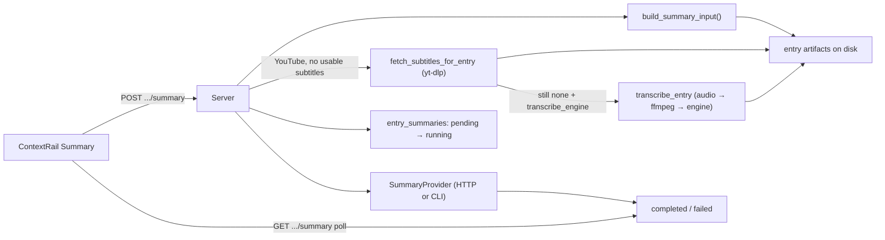

# Archivr Mental Model

This document explains the current project shape after the workspace refactor.

## Key Documents

| Document | Role |
|---|---|
| `ARCHIVR-MENTAL-MODEL.md` | **This file.** Current architecture, data flows, and where to edit. |
| `docs/README.md` | User-facing docs: how to run the tool, supported inputs, environment variables. |

## The Big Model

archivr is now a Rust workspace with three crates:


```mermaid
flowchart LR
  CLI["archivr-cli"] --> Core["archivr-core"]
  Server["archivr-server"] --> Core
  UI["static web UI"] --> Server
  ServerConfig["server TOML registry"] --> Server
  Core --> DB["archive/.archivr/archivr.sqlite"]
  Core --> Store["archive store: raw, raw_tweets, structured, temp"]
```

The key rule:

> `archivr-core` owns archive behavior. `archivr-cli` and `archivr-server` are adapters.

## Crates

| Crate | Responsibility |
|---|---|
| `archivr-core` | Archive/domain logic, database schema, queries, download/store helpers |
| `archivr-cli` | Command-line interface, argument parsing, terminal behavior |
| `archivr-server` | Web server, API routes, mounted archive registry, static UI |

## Archive Model

Each archive is still self-contained:

```text
some-archive/
  .archivr/
    archivr.sqlite
    name
    store_path
store/
  raw/
  raw_tweets/
  structured/
  temp/
```

The web server can mount many independent archives through its own TOML registry.
That registry is separate from the archives themselves.

Example:

```toml
[[archives]]
id = "personal"
label = "Personal"
archive_path = "/path/to/archive/.archivr"
```

## Entry Nesting

Entries support a two-level parent/child hierarchy. A **container entry** (playlist or channel) holds zero or more child entries (individual videos). Container entries have no primary media artifact of their own; their `total_artifact_bytes` is the sum of their children's bytes.

Rules:
- Maximum nesting depth is 2 (root → child). Children cannot have children.
- The UI shows child entries collapsed under their parent, expandable with a chevron.
- Container entries are created by playlist/channel captures. Single-video and all other source types produce a standalone root entry with no children.
- Children have a persisted sibling order: `archived_entries.position` (0-based per parent, `NULL` for roots). `list_child_entries` orders by it (tie-break `archived_at, id`).
- New children are always appended (`MAX(position)+1` in `create_archived_entry`): an initial playlist/channel capture keeps playlist enumeration order; sync appends newly found videos after the existing (possibly user-reordered) children.
- Users whose roles are allowed by the instance setting `reorder_children_role_bits` (auth DB `instance_settings`; default ADMIN|OWNER = 12; editable only by the Owner in Settings → Instance → Permissions) reorder an expanded parent's children on the main page. Exactly one control is shown, selected purely in CSS: the ↑/↓ buttons are the default, and a single `(hover: hover) and (pointer: fine) and (min-width: 641px)` query swaps in the drag handle (HTML5 drag-and-drop). Touch, no-pointer, phone-width (≤ 640px) viewports, and browsers that can't evaluate the query keep the arrows, since HTML5 DnD is unreliable there and no feature test detects it. Alt+↑/↓ on a focused child row works on all inputs (advertised via `aria-keyshortcuts`). The UI sends the full child UID list to `PUT /api/archives/:archive_id/entries/:entry_uid/children/order` (401 guest, 403 role not in mask, 404 unknown parent or a parent the caller can't see under the `list_child_entries` rule (`database::caller_sees_all_children`), 400 unless the list is exactly the current children). `/api/auth/me` and login return `can_reorder_children`; the UI hides reorder controls when it is false.

If a feature touches how entries are parented or how the UI groups them, start in `archivr-core` (`database.rs` for schema, `archive.rs` for listing, `capture.rs` for creation). Child-order UI lives in `routes.rs` (`reorder_entry_children_handler`) and `frontend/src/components/EntryRow.jsx`.

## How To Run It

There are two user-facing binaries:

| Binary | Purpose |
|---|---|
| `archivr` | CLI for initializing archives and capturing material into one archive (also `yt-dlp status\|update`; the web UI equivalent is Settings › Instance › yt-dlp) |
| `archivr-server` | Web server for browsing one or more existing archives |

The CLI writes archive data:

```sh
nix run .#archivr -- init ./my-archive --name "My Archive"
nix run .#archivr -- archive file:///absolute/path/to/file.pdf
```

The server reads archive data:

```sh
nix run .#archivr-server -- ./archivr-server.toml
```

If no config path is passed, the server reads `./archivr-server.toml`.
The config is a server registry, not archive data:

```toml
[[archives]]
id = "personal"
label = "Personal"
archive_path = "/absolute/path/to/my-archive/.archivr"
```

The packaged Nix server wrapper sets `ARCHIVR_STATIC_DIR` so the server can find the installed web UI assets. Source-tree runs do not need that variable because they fall back to `crates/archivr-server/static`.

## Write Data Flow

When archiving something through the CLI:


```mermaid
sequenceDiagram
  participant User
  participant CLI
  participant Core
  participant Store
  participant DB

  User->>CLI: archivr archive path-or-url
  CLI->>Core: classify source and call downloader/store helpers
  Core->>Store: save raw/structured artifacts
  Core->>DB: insert run, source identity, entry, artifacts
  CLI->>User: terminal result
```

**YouTube subtitles are sidecar artifacts.** For `Source::YouTubeVideo` (single videos and YouTube playlist/channel
children) with `CaptureConfig::download_subtitles` set (the default), the yt-dlp media call also writes up to two
subtitle files (see [yt-dlp Lifecycle](#yt-dlp-lifecycle)). `subtitles::archive_staged_subtitles` moves them into
`raw/` through `store::archive_staged_file` (same SHA3 dedup) before the temp dir is removed, and
`subtitles::register_subtitle_artifacts` records each one as a `subtitle` artifact once the entry exists:
`storage_area = "raw"`, MIME `text/vtt` or `application/x-subrip`, and `metadata_json`
`{language, kind, format, original_language, origin}` with `kind` `manual`/`auto`/`unknown` and `origin` `capture` or
`summary_fetch`. Registration runs in one `BEGIN IMMEDIATE` transaction and skips an existing
(entry, `subtitle`, blob) row. Subtitle archive and register errors are warnings; the capture still succeeds. The CLI
(`--no-subtitles`), the capture API (`download_subtitles: false`) and the capture dialog toggle all turn it off.

**Pasted text short-circuits most of that.** `perform_text_capture` (`capture.rs`) is not a `Source`
route: there is no locator to classify, no URL probe, and no downloader subprocess. It validates the
title (non-empty, ≤ 500 chars), the body (non-empty, ≤ 2 MiB) and the MIME type (`text/plain` or
`text/markdown` only), then calls `downloader/text.rs` to write the bytes into `store/temp/<timestamp>/`
and hash them. From there it rejoins the normal path — dedup into `raw/A/B/HASH.EXT`, then run, entry
and artifact rows. The server exposes it as `POST /api/archives/:archive_id/captures/text`, and the UI
drives it from `CaptureTextRow` in `CaptureDialog.jsx`. The body is preserved byte-for-byte, the entry's
`original_url` remains empty (no fabricated `text:` URL), and its normal entry-rail preview renders through
`TextPreview.jsx`.

## Web Capture Pipeline

Web pages (`Source::WebPage`) take a longer path than yt-dlp or tweets:

1. **Fetch URL selection.** If `via_freedium` is set and the locator isn't already a Freedium URL, the downloader fetches the page through `freedium-mirror.cfd` with no forwarded cookies. The canonical DB URL stays the original locator.
2. **Browser capture.** `downloader/singlefile.rs` shells out to `single-file-cli` driving headless Chromium. Extensions (uBlock, cookie-consent) and injected browser scripts (modal closer, reader mode) attach per `CaptureConfig`.
3. **Reader mode** (optional) concatenates Mozilla's `Readability.js` from `vendor/readability/` into the SingleFile browser script and stamps absolute URLs on lazy images so the serialised DOM points to fetchable sources.
4. **Freedium cleanup** strips mirror UI (nav, footer, toaster, author header, download control) using multi-signal selectors so article-authored controls aren't hit.
5. **Rust post-processing.** After SingleFile writes the HTML, a Rust pass fetches any images the browser couldn't inline (bounded reads, same-origin cookie forwarding) and embeds them as data URIs. Title extraction runs after embedded font blocks are stripped so large fonts don't push `<title>` beyond the read window.

## Read Data Flow

When opening the web UI:


```mermaid
sequenceDiagram
  participant Browser
  participant Server
  participant Core
  participant DB

  Browser->>Server: GET /api/archives
  Browser->>Server: GET /api/archives/:id/entries
  Server->>Core: list_root_entries(conn)
  Core->>DB: query archive SQLite
  DB-->>Core: rows
  Core-->>Server: summaries
  Server-->>Browser: JSON
```

## LLM Summaries

Summaries are a **post-capture, manually triggered** subsystem. Nothing in `capture.rs` calls the
summarizer; a summary exists only because someone pressed generate in the Summary section of
`ContextRail.jsx`.

`crates/archivr-core/src/summarizer.rs` defines one `SummaryProvider` trait with four implementations:
Anthropic HTTP, OpenAI-compatible HTTP, the local `claude` CLI, and the local `codex` CLI. Each is
built purely from environment variables (`provider_from_env`), so no key or model name is ever written
into archive data. `PROMPT_VERSION` in the same file stamps every row, so changing the prompt
invalidates the cache instead of silently mixing generations.

`entry_summaries` (schema in `database.rs`) is that cache, unique on
(`entry_id`, `provider_kind`, `provider_model`, `prompt_version`, `input_sha256`) — the requested provider
model is the cache identity, so the same entry summarised by two providers, two requested models, or after a
prompt change yields distinct rows, while a repeat request with identical inputs reuses one. When a provider
returns its concrete resolved model, it is stored separately and displayed as attribution without changing that
identity. Rows move `pending` → `running` → `completed` | `failed`, mirroring how capture jobs are tracked;
the frontend polls only for the currently selected entry, and its generate callbacks are scoped to that same
selection. Image-selection behavior remains unchanged.

On startup the server marks interrupted `pending` or `running` attempts failed. Regeneration is non-destructive:
the prior completed summary stays visible until a replacement completes successfully. Public readers receive only
completed summary content, never pending/failed state or diagnostic error text.

The summary path is deliberately explicit: UI consent (`Include attached images`) → core selection → input digest and
cache lookup → provider transport → `pending`/`running`/`completed` lifecycle. Text is the default. When consent is
present, `SummaryBuildOptions::include_images` admits only bounded `media` image candidates and the digest includes both
the flag and selected blob identity, MIME type, and size. The core is still synchronous; the server owns the blocking
boundary. Anthropic HTTP, OpenAI-compatible HTTP, and Codex can transport the selected image data; Claude CLI receives
text only.


```mermaid
flowchart LR
  UI["ContextRail Summary"] -->|POST .../summary| Server
  Server --> Input["build_summary_input()"]
  Input --> Artifacts["entry artifacts on disk"]
  Server -->|YouTube, no usable subtitles| Fetch["fetch_subtitles_for_entry (yt-dlp)"]
  Fetch --> Artifacts
  Fetch -->|still none + transcribe_engine| Transcribe["transcribe_entry (audio → ffmpeg → engine)"]
  Transcribe --> Artifacts
  Server --> Row["entry_summaries: pending → running"]
  Server --> Provider["SummaryProvider (HTTP or CLI)"]
  Provider --> Row2["completed / failed"]
  UI -->|GET .../summary poll| Row2
```

**X Articles and tweet threads are why the artifact lookup is special.** For most entries `build_summary_input` reads
the single `primary_media` artifact. A `tweet` or `tweet_thread` entry has no `primary_media` — it has
N `raw_tweet_json` artifacts, one per status in the thread. So the summarizer selects on the
`raw_tweet_json` role instead, loads **all** matching artifacts in order, and joins them with
`\n\n---\n\n`; a `---` line reads as a hard paragraph break to every model, keeping individual
statuses from bleeding into one another. For an X Article, the reducer prefers article text over the tweet's body:
`plain_text`, then flattened ordered blocks, then `preview_text`, then `summary_text`; only then does it fall back to
`full_text`/`text`/`content`/`body`. Any change to article reduction or thread status storage must be mirrored here.

**Tweet entry titles.** When the status is an X Article, the title is `<article.title> — @handle`; otherwise the
tweet-text excerpt (`caption_excerpt`). On server startup `capture::backfill_x_article_titles` retitles only rows whose title still
byte-equals the legacy bare-link title recomputed from their raw JSON and whose raw JSON has an Article title. It is
compare-and-set and idempotent. Titles carry no provenance flag, so exact equality is the guard: renamed titles are
never touched, but a title renamed back to the exact legacy string is retitled. It runs only in `archivr-server`;
CLI-only installs never backfill. Rearchive still does not change titles.

**Thread titles** (`thread_title.rs`) are manual and synchronous: the rail's **Generate title** button on
`tweet_thread` entries calls `POST .../entries/:entry_uid/thread-title` (user role, the same gate as rename). It reuses
the selected provider's transport (`summarizer::complete_plain`) with a cheap title model — admin instance setting
`instance_settings.title_model_<kind>`, else `ARCHIVR_*_TITLE_MODEL`, else a per-provider default, never the summary
model; the server passes the instance value to core as an `Option<&str>` override (core never reads the auth DB) — and
never touches `entry_summaries`. The model returns only the topic; the server sanitizes it and owns the
`Thread about <topic> — @author` format, saved via `update_entry_title`. The bulk panel's **Generate titles** (≥2
selected, ≥1 thread) loops the same endpoint client-side over the selected threads, 2 at a time, with the rail's
provider; a selection change stops it from starting further entries.

**YouTube videos are summarized from a `subtitle` artifact, never the mp4.** For `youtube`/`video` entries
`build_summary_input` skips `primary_media` and reads the entry's `subtitle` artifacts (VTT/SRT by extension or MIME).
`subtitles::subtitle_track_rank` orders them — 0 manual English, 1 manual original language, 2 other manual, 3
transcribed (any language), 4 auto/unknown original language, 5 auto/unknown English, 6 the rest; ties go to the lowest
artifact id — and the first
track that reduces to a non-empty transcript wins. `subtitles::subtitle_to_transcript` drops header/`NOTE`/`STYLE`
blocks, cue ids, timing lines, cue settings, inline tags and ASS overrides, decodes entities, and collapses rolling
auto-caption repeats. Content is `Transcript ({language}, {kind} subtitles):` plus the transcript, truncated at
48,000 chars like every input; the digest covers it, so adding or switching subtitles changes `input_sha256`.

No usable track yields `NoSubtitlesAvailable` (`is_no_subtitles_error`, distinct from unsupported content). The server
preflight then inserts a `pending` row whose `input_sha256` is the placeholder `SUBTITLE_FETCH_PENDING_INPUT_SHA256`
(`"pending-subtitle-fetch"`, never a real digest), skips the cache lookup, and returns 202. Its blocking task loads
cookie rules from the auth DB and calls `build_summary_input_with_subtitle_fetch`: `fetch_subtitles_for_entry` returns
early for non-YouTube entries, non-`http(s)` canonical URLs, or an entry that already has a usable track; otherwise it
runs `fetch_metadata`, `plan_subtitle_request` and a subtitles-only `download_subtitles`, and registers the results
with origin `summary_fetch`. An unreachable video or any yt-dlp error counts as zero subtitles. Then the input is
rebuilt. On success `update_entry_summary_input_sha256` writes the real hash and the provider runs. If there are still
no subtitles and the request named a `transcribe_engine`, `transcriber::transcribe_entry` runs (step 3 of the fixed
order archived → fetched → transcribed → error), then the input is rebuilt once more. Transcription never runs when
either earlier step yields a usable track. Otherwise the row fails with `NO_SUBTITLES_SUMMARY_MESSAGE` (or a
transcription-specific copy when an engine ran) and no provider is called. Entries that already have usable subtitles
keep the synchronous preflight.

**Local transcription** (`transcriber.rs`): engines `whisper` (whisper.cpp or a `script` wrapper), `parakeet` (script),
`phonon2` (English only, `--json` stdout → VTT), configured only by env and gated by `ARCHIVR_TRANSCRIBE_ENGINES`
(`GET /api/summary/transcription-engines` lists enabled ones). One job at a time per process; audio from the archived
media or a yt-dlp audio download, ffmpeg to 16 kHz mono WAV, all within one `ARCHIVR_TRANSCRIBE_TIMEOUT` budget
(ffmpeg and engines via `process::run_with_timeout`; the yt-dlp audio call via `ytdlp.rs`'s own runner). The result is a `subtitle` artifact with kind `transcribed`, origin `transcription`, plus
`engine` and `model` metadata. Spec and deviations:
`docs/superpowers/specs/2026-10-05-local-transcription-fallback.md`.

## yt-dlp Lifecycle

There is no single yt-dlp. Up to three can exist on one machine:

1. **The flake pin** — the `ytDlp` derivation in `flake.nix` fetches an exact release zipapp from
   `github.com/yt-dlp/yt-dlp/releases` and wraps it with `python312` + `ffmpeg`. Both the `archivr` and
   `archivr-server` wrappers export it as `ARCHIVR_YT_DLP`.
2. **A state-dir install** — `archivr yt-dlp update` downloads the latest zipapp and installs it
   atomically (staged file, then rename) at `<state_dir>/yt-dlp/yt-dlp` with a sibling `.version`
   sentinel that lets repeat runs skip the download.
3. **Whatever is on PATH** — the historical behaviour, and the last-resort fallback.

`resolve_yt_dlp()` in `downloader/ytdlp.rs` picks between them and caches the result in an `RwLock` until
`refresh_yt_dlp()`: `ARCHIVR_YT_DLP_FORCE` wins outright if it points at a real file; otherwise the pinned and
state-dir candidates are probed with `--version` and the newest wins — yt-dlp versions are `YYYY.MM.DD`,
so plain string ordering is chronological — with exact ties going to the state-dir copy the user
deliberately installed. If neither exists, it falls back to bare `yt-dlp`. `archivr yt-dlp status`
prints every candidate, its version, and the winner; when the force variable applies, it includes that
forced candidate and selects it as the winner.

Three ways to move the version forward: the weekly `.github/workflows/update-ytdlp.yml` cron (reads the
current pin, queries the GitHub releases API, re-hashes with `nix hash file --sri`, rewrites the `ytDlp`
block and opens a PR), `archivr yt-dlp update` / Settings › Instance › yt-dlp for one machine, or editing `flake.nix` by
hand.

**The JS runtime has the same shape.** YouTube's player challenges are solved by yt-dlp's EJS solver, which needs
Deno ≥ 2.3.0. Candidates: the Nix/Docker pin in `ARCHIVR_DENO`, `<state_dir>/deno/deno`, and `deno` on PATH.
`resolve_js_runtime()` in `downloader/js_runtime.rs` (cached in an `RwLock` until `refresh_js_runtime()`, returns an owned clone, warnings printed once per resolution) returns a valid
`ARCHIVR_JS_RUNTIME` force (`RUNTIME[:ABS_PATH]`, `deno|node|bun|quickjs`, invalid values warned and ignored)
outright; otherwise it probes the pinned and state-dir Deno, drops anything below 2.3.0, compares real semver
(`DenoVersion`, so 2.10.0 > 2.9.7) and keeps the newest, ties to the state dir; then PATH; else `None` plus a one-time
warning. Only Deno is chosen automatically. Every yt-dlp process is built by `yt_dlp_command()` in `ytdlp.rs`, which
appends `js_runtime_args()` (`--js-runtimes deno:<path>`; non-Deno forces get `--no-js-runtimes` first) — the
`download` closure (incl. the media-only retry), `download_subtitles`, `fetch_metadata_with_timeout`,
`fetch_playlist_info` and `probe_playlist_qualities`. The update also installs the latest Deno
(`crates/archivr-core/src/downloader/deno_install.rs`): download, extract to `deno.new`, require `--version` to equal the release,
then atomic rename. `status` adds a JS runtime table with rows `force (ARCHIVR_JS_RUNTIME)`, `env (ARCHIVR_DENO)`,
`state-dir`, `path (deno)`; the star goes to the winning `JsRuntimeRole` from `resolve_js_runtime_with_role()`, not to
every row whose path matches (the Nix wrappers' pinned Deno is also on PATH).

**One updater, two front ends.** `downloader/ytdlp_tools.rs` owns `install_yt_dlp`, `update_tools` and the
`tools_status()` model; the CLI renders it as text and `GET /api/admin/yt-dlp` / `POST /api/admin/yt-dlp/update`
(admin, 409 while an update runs) serve it to Settings › Instance › yt-dlp. `update_tools` calls `refresh_yt_dlp()` /
`refresh_js_runtime()` after each successful component, so a UI update takes effect without a restart; commands
already built keep their old binary. A CLI update runs in another process, so a running server still needs a restart.

**Subtitles ride on the media call.** When capture wants subtitles, `plan_subtitle_request` builds a bounded (≤ 2
tracks) request from the `--dump-json` metadata capture already fetched. `download` then appends `--write-subs` and/or
`--write-auto-subs` (only the kinds planned), `--sub-langs <codes>`, `--sub-format vtt/srt/best` and `--ignore-errors`.
There is no `--convert-subs`, so ffmpeg is never needed for subtitles. yt-dlp treats `--sub-langs` entries as regexes,
so planned codes are limited to `[A-Za-z0-9][A-Za-z0-9-]*`. Without metadata the request falls back to `en` and
`.*-orig`. If the combined call exits non-zero without staging media and its stderr mentions subtitles, it is
retried once with the exact legacy media-only arguments (`should_retry_media_only`), and subtitle files from the
first attempt are still collected; other failures (private, deleted, geo-blocked) fail without a retry.
`collect_staged_outputs` splits the staging dir into the
media file and `<stem>.<lang>.<vtt|srt>` sidecars; other subtitle formats are dropped with a warning. Summary-time
fetches use `download_subtitles` instead: `--skip-download --no-playlist --ignore-no-formats-error` plus the same
subtitle args and `--ignore-errors`, staged under `temp/subs-<uuid>/`. A non-zero exit is tolerated if any subtitle
file was written. The summary-time metadata probe and subtitle call are killed after `ARCHIVR_SUMMARY_CLI_TIMEOUT`
(a timeout counts as "no subtitles"); capture-time calls stay unbounded. Blob cleanup refuses to run while such a
fetch is in flight (`has_pending_subtitle_fetches`). Every one of these calls is built with `yt_dlp_command()`.

## Where To Edit

| Feature kind | Edit here |
|---|---|
| DB schema, inserts, archive runs, entries, tags | `crates/archivr-core/src/database.rs` |
| Capture orchestration, `Source` routing, `CaptureConfig` | `crates/archivr-core/src/capture.rs` |
| Archive opening, listing entries, entry detail, runs | `crates/archivr-core/src/archive.rs` |
| Download/save behavior | `crates/archivr-core/src/downloader/` |
| YouTube playlist/channel download, playlist probe, sync mode | `crates/archivr-core/src/downloader/ytdlp.rs` and `capture.rs` |
| Which yt-dlp binary runs (resolver, state dir, version probe) | `crates/archivr-core/src/downloader/ytdlp.rs` |
| Which JS runtime yt-dlp gets (Deno resolver, `ARCHIVR_JS_RUNTIME`, `--js-runtimes` args) | `crates/archivr-core/src/downloader/js_runtime.rs` |
| yt-dlp/Deno update orchestration and status model (CLI + admin API) | `crates/archivr-core/src/downloader/ytdlp_tools.rs` |
| Deno installer (CLI and UI update) | `crates/archivr-core/src/downloader/deno_install.rs` |
| Settings › Instance › yt-dlp section | `frontend/src/components/SettingsView.jsx` (`YtDlpSection`) |
| YouTube subtitles (track planning, yt-dlp args, staging) | `crates/archivr-core/src/downloader/ytdlp.rs` |
| Subtitle artifacts, transcript reduction, track ranking, summary-time fetch | `crates/archivr-core/src/subtitles.rs` |
| Pasted-text capture (staging, hashing, MIME allowlist) | `crates/archivr-core/src/downloader/text.rs` and `capture.rs` |
| LLM summary providers, prompt, `PROMPT_VERSION`, input building | `crates/archivr-core/src/summarizer.rs` |
| Local transcription engines, audio, job slot, `transcribe_entry` | `crates/archivr-core/src/transcriber.rs` |
| Subprocess timeout runner | `crates/archivr-core/src/process.rs` |
| Shared `ARCHIVR_*` env helpers | `crates/archivr-core/src/env_config.rs` |
| Thread-title generation, cheap title models | `crates/archivr-core/src/thread_title.rs` |
| X Article titles + startup backfill | `crates/archivr-core/src/capture.rs` (`backfill_x_article_titles`), called from `archivr-server/src/main.rs` |
| `entry_summaries` schema and summary CRUD | `crates/archivr-core/src/database.rs` |
| CLI commands, argument parsing, terminal output | `crates/archivr-cli/src/main.rs` |
| Server API routes | `crates/archivr-server/src/routes.rs` |
| Auth model (users, sessions, tokens, roles), Bearer/cookie extraction | `crates/archivr-server/src/auth.rs` |
| Own sessions and API tokens (`/api/auth/sessions`, token scope/expiry), admin password reset and per-user session/token revocation | `crates/archivr-server/src/credentials.rs` |
| Admin user delete/status, role CRUD and assignment | `crates/archivr-server/src/admin_users.rs` |
| Target-aware guards (manage, not self, last owner) | `crates/archivr-server/src/guards.rs` |
| Read-scope token enforcement (non-GET/HEAD/OPTIONS → 403) | `crates/archivr-server/src/token_scope.rs` |
| Capture job list/detail, `created_by` visibility, run visibility | `crates/archivr-server/src/jobs.rs` |
| Effective config and `ENV_VARS` registry, archive info | `crates/archivr-server/src/effective_config.rs` |
| Shared server test helpers | `crates/archivr-server/src/test_support.rs` |
| Mounted archive config model | `crates/archivr-server/src/registry.rs` |
| Frontend root state + routing | `frontend/src/App.jsx` |
| Frontend API client | `frontend/src/api.js` |
| Frontend components | `frontend/src/components/` |
| Summary UI (provider selector, transcription engine, generate, polling, thread Generate title) | `frontend/src/components/ContextRail.jsx` |
| Text/Markdown entry preview | `frontend/src/components/TextPreview.jsx` |
| "Add text" capture row | `frontend/src/components/CaptureDialog.jsx` |
| Frontend styling | `frontend/src/styles.css` |

## Practical Feature Rule

If a feature affects archive truth, start in `archivr-core`.

If a feature is only how the terminal behaves, edit `archivr-cli`.

If a feature is only how the browser sees or calls things, edit `archivr-server` and the static UI.

If a browser feature needs new data, the usual order is:

1. Add or query the data in `archivr-core`.
2. Expose it in `archivr-server`.
3. Render it in the static UI.

## Server Capabilities

The server both reads and writes archive data. Capture jobs are asynchronous: `POST /api/archives/:id/captures` inserts a job row, spawns a blocking task, and returns immediately; the frontend polls until the job completes or fails. Heavy work stays synchronous inside `archivr-core`.

**Auth model.** A separate `archivr-auth.sqlite` (path derived from the server config directory) holds users, sessions, and API tokens. Role bits are `u32` flags (`GUEST`, `USER`, `ADMIN`, `OWNER`) so a single bitmask value covers assignment, checks, and visibility. The middleware stack is `setup_guard` → `login_rate_limit` → `security_headers`; route families are classified `READ / ADMIN / WRITE / STATIC` in `routes.rs`. Configurable per-action permissions are `u32` role masks on the auth `instance_settings` singleton (currently `reorder_children_role_bits`). Handlers read them per request and allow when `caller_bits & mask != 0`, so changes take effect without re-login. Only the Owner may change them, and masks may contain only existing non-guest role bits (`database::grantable_role_bits`).

**Search** is server-side free-text filtering over entry fields and the latest completed summary. The summary JSON is
searched as text, so generated `tags` participate. Older completed summaries stay searchable while a newer request is
pending or failed; rows with no completed summary contribute no summary-derived match.

**Token scope and expiry.** API tokens carry `scope` (`full` or `read`) and an optional expiry. `token_scope.rs` answers 403 `read-only token` to a read-scope Bearer request that is not GET, HEAD or OPTIONS. Cookie sessions bypass this check. Bearer use goes through `auth_credentials::touch_token_throttled`, so `last_used_at` is written at most once per 60 seconds.

**Guards.** Management endpoints call `guards.rs` after their coarse `require_role(ROLE_ADMIN)` check: `ensure_can_manage` (only an OWNER may act on a target that has OWNER or ADMIN), `ensure_not_self` (409), and `ensure_not_last_owner` (409, counts active owners). Keep new management endpoints on these helpers rather than re-deriving the rules.

**Capture job visibility.** `capture_jobs.created_by` stores the creator's `user_uid`. Job endpoints show a caller only jobs they created unless they hold ADMIN; rows with no creator are admin-only. `GET /api/archives/:id/runs` follows access: admins see all runs, other callers see runs whose job they created or that produced at least one entry they can see.

**File locators.** `POST /api/archives/:id/captures` accepts `file://` only for a file staged under `temp/uploads/`, so an API caller cannot capture and read back arbitrary server files. The CLI reads local paths directly and is unaffected.

**Inert settings.** `public_index_enabled`, `public_entry_content_enabled` and `open_registration_enabled` are stored and returned by the instance-settings endpoints, but no server logic reads them yet.

**Admin view** covers mounted archives, users, sessions, and API tokens. `admin_users.rs` handles user delete and status, and role CRUD and assignment. `credentials.rs` handles password reset and per-user session and token revocation (`GET /api/admin/users/:uid/tokens`, `DELETE .../tokens/:token_uid`). `GET /api/admin/effective-config` (`effective_config.rs`) serves the static `ENV_VARS` table, with secrets shown only as `set`. `GET /api/archives/:id/info` gives counts and sizes without paths, and `GET /api/archives` returns `archive_path` to admins only.
