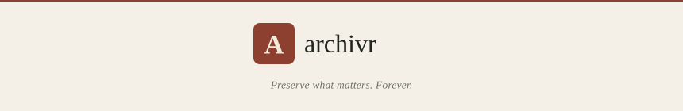

<p align="center">
  <picture>
    <source media="(prefers-color-scheme: dark)" srcset="branding/assets/banner-dark.svg">
    
  </picture>
</p>

<p align="center">
  <a href="../LICENSE.md"></a>
  
  
</p>

---

Archivr is a self-hosted tool for capturing and preserving digital content — YouTube videos and playlists, tweets and threads, Instagram, TikTok, web pages, and local files — into self-contained, locally-owned archives. Content is stored in SQLite with SHA3-256 blob deduplication, hierarchical tags, a browser-based UI, and role-based auth.

## Table of Contents

- [Features](#features)
- [Quick Start](#quick-start)
  - [With Nix](#with-nix)
  - [With Docker](#with-docker-1)
- [Architecture](#architecture)
- [Supported Inputs](#supported-inputs)
  - [YouTube playlists and channels](#youtube-playlists-and-channels)
  - [Video quality and audio-only](#video-quality-and-audio-only)
- [Configuration](#configuration)
  - [TOML config file](#toml-config-file)
  - [Environment variables](#environment-variables)
- [Deployment](#deployment)
  - [Security](#security)
  - [NixOS](#hosting-on-nixos)
  - [Docker](#hosting-with-docker)
- [Development](#development)
- [License](#license)

## Features

- **Social media** — YouTube (videos, shorts, playlists, channels with sync mode), X/Twitter (tweet and thread JSON + media downloads), Instagram, TikTok, Facebook, Reddit, Snapchat via yt-dlp
- **Web pages** — full self-contained HTML snapshots via SingleFile + Chromium; optional Freedium mirror for paywalled articles; reader mode
- **Local files** — import any file from disk by `file://` path
- **Deduplication** — SHA3-256 content-addressed blob store shared across all captures; identical files are stored once
- **Tags and search** — hierarchical tag tree, full-text search, filterable entry list
- **Multiple archives** — the server mounts any number of separate archives from a single TOML config
- **Role-based auth** — Guest / User / Admin / Owner roles; session cookies and API tokens; Argon2 passwords
- **Quality selection** — choose video quality or audio-only per capture; a live metadata probe populates the selector before download

## Quick Start

### With Nix

```sh
# Create an archive
nix run github:thegeneralist/archivr#archivr -- init ./my-archive --name "My Archive"

# Archive something
nix run github:thegeneralist/archivr#archivr -- archive https://www.youtube.com/watch?v=dQw4w9WgXcQ

# Start the web UI (reads ./archivr-server.toml)
nix run github:thegeneralist/archivr#archivr-server
```

Create `archivr-server.toml` next to where you run the command:

```toml
auth_db_path = "/absolute/path/to/archivr-auth.sqlite"

[[archives]]
id = "personal"
label = "Personal"
archive_path = "/absolute/path/to/my-archive/.archivr"
```

Then open `http://127.0.0.1:8080`. On the first visit you will be prompted to create the owner account.

### With Docker

```sh
mkdir config
cp docker/config.example.toml config/archivr-server.toml
# Edit config/archivr-server.toml

# Initialize the archive on the persistent volume (run once)
docker compose run --rm archivr archivr init \
  /data/archives/main /data/archives/main/.archivr/store \
  --name "Main Archive"

docker compose up -d
```

Open `http://localhost:8080`. See [Hosting with Docker](#hosting-with-docker) for volume layout and Twitter/X credential setup.

## Architecture

Two binaries:

| Binary | Purpose |
|---|---|
| `archivr` | CLI — create archives (`init`) and add content (`archive`) |
| `archivr-server` | Web server — browse and search one or more archives via browser UI |

Archive layout created by `archivr init`:

```
my-archive/
├── .archivr/          # metadata: name, store_path, archivr.sqlite
└── store/
    ├── raw/           # deduplicated blobs: raw/A/B/<sha3-256>.ext
    ├── raw_tweets/    # tweet and thread JSON
    ├── structured/    # structured metadata outputs
    └── temp/          # staging area during capture
```

A separate auth database (`archivr-auth.sqlite`, path set in TOML) holds users, sessions, API tokens, and role bits. It is independent of individual archives.

## Supported Inputs

`archivr archive <locator>` accepts URLs and platform shorthands:

| Platform | Input examples |
|---|---|
| Local file | `file:///absolute/path/to/file.pdf` |
| YouTube video / short | `https://youtube.com/watch?v=ID` · `yt:video/ID` · `yt:short/ID` |
| YouTube playlist | `https://youtube.com/playlist?list=ID` |
| YouTube channel | `https://youtube.com/@handle` |
| X/Twitter tweet (JSON) | `tweet:ID` · `x:tweet:ID` · `twitter:tweet:ID` |
| X/Twitter thread (JSON) | `x:thread:ID` · `twitter:thread:ID` |
| X/Twitter media download | `tweet:media:ID` |
| Instagram | Direct URL · `instagram:ID` |
| TikTok | Direct URL · `tiktok:ID` |
| Facebook | Direct URL · `facebook:ID` |
| Reddit | Direct URL · `reddit:ID` |
| Snapchat | Direct URL · `snapchat:ID` |
| Arbitrary URL / web page | Any `https://` URL |

### YouTube playlists and channels

Capturing a playlist or channel creates a **container entry** with each video archived as a child beneath it. Before downloading, the UI probes each video for available quality options — set quality per-video or apply one to the whole batch. Individual videos can be excluded with the remove button.

**Sync mode:** when re-archiving a playlist or channel, enable sync mode in the capture dialog to skip videos that are already in the archive. Only new videos are downloaded; the existing container is reused.

### Video quality and audio-only

When capturing a yt-dlp-backed source through the web UI, a metadata probe runs first and populates the quality selector with heights actually available in that video:

| `qualities` | `has_audio` | UI shows |
|---|---|---|
| `["1080p", "720p", …]` | `true` | Best / heights / Audio only |
| `["1080p", …]` | `false` | Best / heights |
| `[]` | `true` | Audio only (pre-selected) |
| `[]` | `false` | "No media detected" |
| probe fails (502) | — | picker hidden; capture still submittable |

The `POST /api/archives/:id/captures` endpoint accepts an optional `quality` field:

```json
{ "locator": "https://www.youtube.com/watch?v=...", "quality": "720p" }
{ "locator": "https://www.youtube.com/watch?v=...", "quality": "audio" }
```

`"audio"` selects the most efficient native audio track without re-encoding (Opus/WebM preferred, then AAC/M4A). Omitting `quality` or passing `"best"` downloads at the highest available quality.

## Configuration

### TOML config file

```toml
# Optional. Default: 127.0.0.1:8080
bind = "127.0.0.1:8080"

# Required. Persists across upgrades; must be on a writable path.
auth_db_path = "/var/lib/archivr/archivr-auth.sqlite"

[[archives]]
id = "personal"
label = "Personal"
archive_path = "/srv/archivr/personal/.archivr"

[[archives]]
id = "work"
label = "Work"
archive_path = "/srv/archivr/work/.archivr"
```

See `docker/config.example.toml` for a complete annotated example.

### Environment variables

| Variable | Default | Description |
|---|---|---|
| `ARCHIVR_BIND` | `127.0.0.1:8080` | Bind address; overrides `bind` in TOML |
| `ARCHIVR_STATIC_DIR` | `crates/archivr-server/static` | Pre-built frontend asset directory |
| `ARCHIVR_YT_DLP` | `yt-dlp` | yt-dlp binary used for video and social downloads |
| `ARCHIVR_SINGLE_FILE` | `single-file` | single-file-cli binary for web page archiving |
| `ARCHIVR_CHROME` | `chromium` | Chromium executable passed to single-file |
| `ARCHIVR_CHROME_ARGS` | — | Extra space-separated Chromium flags (Docker sets `--no-sandbox`) |
| `ARCHIVR_TWITTER_CREDENTIALS_FILE` | — | Cookies file for tweet/thread scraping — required for `tweet:ID` and `x:thread:ID` inputs |
| `ARCHIVR_TWEET_SCRAPER` | `vendor/twitter/scrape_user_tweet_contents.py` | Tweet scraper script path |
| `ARCHIVR_TWEET_PYTHON` | `python3` | Python executable for the tweet scraper |

The Nix wrapper and Docker image set `ARCHIVR_STATIC_DIR`, `ARCHIVR_SINGLE_FILE`, and `ARCHIVR_CHROME` automatically.

## Deployment

### Security

`archivr-server` binds to `127.0.0.1:8080` by default. Do not expose it to a public network without understanding the risks. When started on a non-loopback address the server logs a warning to stderr.

### Hosting on NixOS

The flake exposes `nixosModules.default`:

```nix
# flake.nix (your system flake)
{
  inputs.archivr.url = "github:thegeneralist/archivr";

  outputs = { nixpkgs, archivr, ... }: {
    nixosConfigurations.myhost = nixpkgs.lib.nixosSystem {
      modules = [
        archivr.nixosModules.default
        {
          services.archivr-server = {
            enable = true;
            # listenAddress defaults to "127.0.0.1"
            # port defaults to 8080
            archives = [
              { id = "personal"; label = "Personal"; path = "/srv/archivr/personal/.archivr"; }
              { id = "work";     label = "Work";     path = "/srv/archivr/work/.archivr"; }
            ];
          };
        }
      ];
    };
  };
}
```

The module creates an `archivr` system user and group, generates the TOML config from your options, stores the auth database at `/var/lib/archivr-server/` (persists across upgrades), and runs under a hardened systemd unit (`ProtectSystem = strict`, `NoNewPrivileges`, `PrivateTmp`). Archive directories are whitelisted for read-write access.

Set `openFirewall = true` with a non-loopback `listenAddress` only when LAN or remote access is required.

Archive directories must be owned by the `archivr` user. Initialise them with `archivr init` first, then `chown -R archivr:archivr /srv/archivr`.

### Hosting with Docker

```sh
# 1. Configure
mkdir config
cp docker/config.example.toml config/archivr-server.toml
# Edit archivr-server.toml — set id, label, archive_path, and auth_db_path

# 2. Initialize each archive (run once per archive)
docker compose run --rm archivr archivr init \
  /data/archives/main /data/archives/main/.archivr/store \
  --name "Main Archive"

# 3. Start
docker compose up -d
```

| Mount | Purpose |
|---|---|
| `./config` (read-only) | Directory containing `archivr-server.toml` |
| `archivr-data` named volume | Auth database (`/data/archivr-auth.sqlite`) and archive directories |

> **Important:** `auth_db_path` must point to a path on the writable data volume (e.g. `/data/archivr-auth.sqlite`). The example config sets this correctly. A bare `mkdir` is not enough to initialise an archive — `archivr init` writes metadata files the server requires.

**Twitter/X archiving:** supply a cookies file inside the config volume and reference it in `docker-compose.yml`:

```yaml
environment:
  ARCHIVR_TWITTER_CREDENTIALS_FILE: /config/twitter-cookies.txt
```

**Building locally:**

```sh
docker build -t archivr-server .
```

The image compiles the Rust binary in a separate build stage; only runtime dependencies (Chromium, Node.js, Python) land in the final layer.

## Development

Runtime dependencies beyond Rust and Node: `yt-dlp`, Chromium, `single-file` (Node), Python 3 with `twitter-api-client`, `ffmpeg`. `nix develop` provides the dev subset.

```sh
# Rust (workspace root)
cargo build
cargo test
cargo test -p archivr-core
cargo run -p archivr-server -- ./archivr-server.toml

# Frontend (from frontend/)
bun install
bun run dev        # Vite dev server
bun run build      # → crates/archivr-server/static/
bun run storybook  # Component QA on :6006

# Nix
nix develop        # dev shell
nix build .#archivr-server
```

## License

MIT — see [LICENSE](../LICENSE.md).
