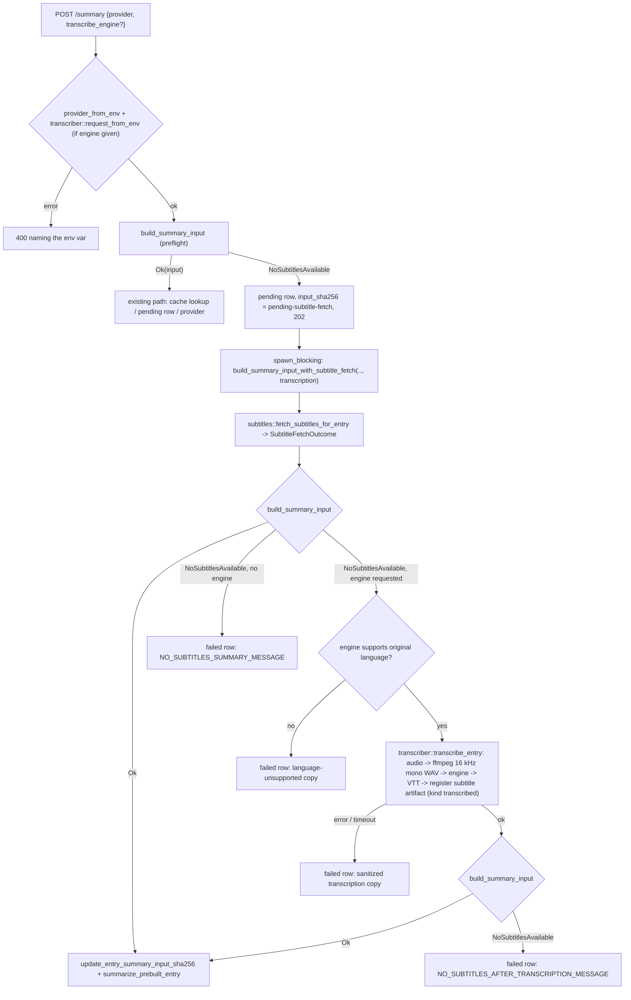

# Spec: local transcription fallback for YouTube summaries

- **Status:** Implemented (2026-10-05). See "Implementation deviations" at the end for where the code differs from this text.
- **Date:** 2026-10-05
- **Depends on:** the YouTube subtitle capture and subtitle-based summarization feature (subtitle artifacts, `crates/archivr-core/src/subtitles.rs`, fetching subtitles on demand at summary time, and the `NoSubtitlesAvailable` failure). The symbols named below come from that feature.
- **Audience:** a model or engineer who implements this without any other context. Read `AGENTS.md` and `ARCHIVR-MENTAL-MODEL.md` first. The repo rules apply throughout:
  - core stays synchronous
  - errors are `anyhow`
  - logging uses `eprintln!` with `info:`/`warn:` prefixes
  - external tools are configured by `ARCHIVR_*` env vars, never TOML
  - yt-dlp processes are only built with `yt_dlp_command()` (resolver-chosen binary plus `--js-runtimes`)
  - frontend API calls only go through `frontend/src/api.js`
  - CSS is plain
  - tests are in-file `#[cfg(test)]` modules

Markers used in this document:
- **[INFERENCE]**: a claim about third-party software that was *not* run while writing this spec. The implementer must check it against the installed version before relying on it.
- **[UNKNOWN]**: information the sources did not provide.

---

## 1. Goal and non-goals

### Goal
A summary is requested for a `youtube`/`video` entry. No subtitle artifact is archived, and fetching subtitles on demand from the original video adds none. Today that ends in `NO_SUBTITLES_SUMMARY_MESSAGE`. With this feature, Archivr can **optionally transcribe the audio locally** with an engine the user picks:

| Engine kind | Label | Languages |
|---|---|---|
| `whisper` | Whisper (whisper.cpp natively, or faster-whisper or any other Whisper runtime through a wrapper script) | multilingual |
| `parakeet` | NVIDIA Parakeet (`parakeet-tdt-0.6b-v2`/`-v3` through a wrapper script around NeMo, parakeet-mlx, sherpa-onnx, …) | English (v2) or 25 European languages (v3) |
| `phonon2` | Fermion Research Phonon-2 | **English only** |

The transcript is stored as a normal `subtitle` artifact with `kind: "transcribed"`, so the existing ranking, reduction and digest code turns it into summary input without any special cases. Later summaries of the same entry reuse it and do not transcribe again.

### Non-goals
- **No cloud ASR.** Everything runs as a local subprocess on the server host. HTTP transcription APIs (including Phonon's own `fermion serve` OpenAI-compatible endpoint) are out of scope; see §12.
- **No automatic transcription at capture time.** It only happens when a user asks for a summary and picks an engine in that request. A capture-time option is a possible later extension (§12).
- **No transcription for non-YouTube media.** Other video and audio entries still get `UNSUPPORTED_SUMMARY_CONTENT_MESSAGE`. Extending to them is §12.
- **Archivr does not bundle models or Python engine runtimes.** Models are large and licensed separately. Users install engines and point env vars at them. The deployment changes (§10) only wire up `ffmpeg` and pass env vars through.
- **No re-transcription UI or engine switching** for an entry that already has a transcript (§12).
- **No word-level timestamps, diarization or translation.** The output is a plain cue-level VTT.
- **No new TOML config.**

---

## 2. Background: what exists after the subtitle feature

These symbols are the shared contracts of the subtitle feature. Reuse them; do not reimplement them.

| Area | Symbol | Behaviour relevant here |
|---|---|---|
| `downloader/ytdlp.rs` | `SubtitleKind { Manual, Auto, Unknown }`, `as_str`, `parse` | The kind is persisted in artifact `metadata_json.kind`. |
| | `StagedSubtitle { path, language, kind, format, original_language }` | A staged sidecar file in `store/temp/<key>/`. |
| | `plan_subtitle_request(metadata_json) -> Option<SubtitleRequest>` | Derives `original_language` from `--dump-json` (`language` field, or else an auto key ending `-orig`). |
| | `pub(crate) language_base(code)` | Lowercases, strips `-orig`, keeps the first `-` segment (`"de-orig"` → `"de"`, `"en-GB"` → `"en"`). |
| | private `is_safe_language_code(code)` | `^[A-Za-z0-9][A-Za-z0-9-]*$`. |
| | `fetch_metadata(url, cookies) -> Option<String>`, `fetch_metadata_with_timeout(url, cookies, timeout)` | `--dump-json`; `None` when the video can't be reached or the bound expires. Summary-time calls (and `download_subtitles`) are bounded by `ARCHIVR_SUMMARY_CLI_TIMEOUT`. |
| | `resolve_yt_dlp()`, `yt_dlp_command(&ytdlp)` | `resolve_yt_dlp()` picks the binary; `yt_dlp_command()` is the only way to build a yt-dlp `Command` (adds the resolved `--js-runtimes` args). |
| `downloader/store.rs` | `archive_staged_file(file, store_path) -> Result<PathBuf>` | SHA3 content-addressed move into `raw/`. |
| `subtitles.rs` | `SUBTITLE_ARTIFACT_ROLE = "subtitle"`, `SUBTITLE_ORIGIN_CAPTURE`, `SUBTITLE_ORIGIN_SUMMARY_FETCH` | Role and origin strings. |
| | `SubtitleFormat { Vtt, Srt }` with `detect`, `mime`, `extension` | |
| | `ArchivedSubtitle { raw_relpath, language, kind, format, original_language }` | |
| | `archive_staged_subtitles(store_path, staged) -> Vec<ArchivedSubtitle>` | Per-file errors are logged and skipped. |
| | `register_subtitle_artifacts(conn, store_path, entry_id, subs, origin) -> Result<usize>` | IMMEDIATE transaction; skips an existing `(entry, "subtitle", blob)` and logs/skips a file it can't stat. |
| | `fetch_subtitles_for_entry(paths, entry_uid, cookie_rules) -> Result<usize>` | Fetches on demand. Returns early with `Ok(0)` for non-YouTube or non-`http(s)` entries, and with `Ok(n)` when a usable (non-empty) subtitle track already exists. |
| | `subtitle_to_transcript`, `parse_subtitle_metadata`, `subtitle_track_rank` | Reducer, metadata parse, ranking. |
| `database.rs` | `entry_source_info`, `list_entry_artifacts_by_role`, `entry_has_artifact_blob`, `update_entry_summary_input_sha256` | |
| `summarizer.rs` | `NO_SUBTITLES_SUMMARY_MESSAGE`, `SUBTITLE_FETCH_PENDING_INPUT_SHA256`, `is_no_subtitles_error`, `build_summary_input_with_subtitle_fetch(paths, entry_uid, options, cookie_rules)` | Background fetch-then-build entry point. |
| | private `run_cli(executable, args, prompt, timeout_secs)` | Thread + channel watchdog: the child is killed when `recv_timeout` expires. |
| | `required_env`, `env_or`, `optional_env`, `env_timeout`, `resolve_cli` (private) | Env-resolution helpers. |
| `routes.rs` | `request_entry_summary_handler` with `PreflightOutcome::{Cached, Pending, FetchSubtitles}`; `summary_failure_error_text`; `record_background_summary_failure` | Server flow. |
| `ContextRail.jsx` | `SUMMARY_PROVIDERS`, `SUMMARY_PROVIDER_KEY` sessionStorage, the `.rail-summary-controls` block, the "Generating…" spinner, 1500 ms polling, the failed-attempt `<p className="form-msg form-msg--err rail-summary-error">` | UI. |

The ranking table from the subtitle feature (D4), which this spec extends in §7:

| Rank | Track |
|---|---|
| 0 | manual + en |
| 1 | manual + orig |
| 2 | other manual |
| 3 | auto/unknown + orig |
| 4 | auto/unknown + en |
| 5 | anything else |

---

## 3. Where it plugs in

Transcription runs **inside the background summary worker**, between fetching subtitles on demand and the final `NoSubtitlesAvailable` error. During that time the summary row stays `pending`, holding the placeholder `input_sha256 = SUBTITLE_FETCH_PENDING_INPUT_SHA256`. That is the same row lifecycle the subtitle fetch already uses, so the UI shows the existing "Generating…" spinner and polls every 1500 ms.

Transcription runs only when **all** of these hold:
1. The POST body names an engine in `transcribe_engine`. That engine is listed in `ARCHIVR_TRANSCRIBE_ENGINES` and fully configured. Both are checked synchronously at preflight, before any row is created; a failure is a 400.
2. The entry is `youtube`/`video`. `build_summary_input` returned `NoSubtitlesAvailable` at preflight, so the handler took the `PreflightOutcome::FetchSubtitles` branch.
3. After `fetch_subtitles_for_entry`, `build_summary_input` **still** returns `NoSubtitlesAvailable`. Rebuilding is the ground truth: the fetch can add nothing, or add only tracks that reduce to empty text, and both cases must lead to transcription.
4. The engine accepts the video's language (§6.5).



No provider/LLM call happens on any failure path.

### 3.1 Changed entry point

Change the signature of `summarizer::build_summary_input_with_subtitle_fetch` and migrate its single caller in `routes.rs`. This is a clean cutover: no second function and no shim.

```rust
pub fn build_summary_input_with_subtitle_fetch(
    paths: &ArchivePaths,
    entry_uid: &str,
    options: SummaryBuildOptions,          // Copy
    cookie_rules: &[database::CookieRule],
    transcription: Option<&transcriber::TranscriptionRequest>,
) -> Result<SummaryInput>
```

Body, in order:
1. Call `subtitles::fetch_subtitles_for_entry(paths, entry_uid, cookie_rules)?`. It now returns a `SubtitleFetchOutcome` (§6.6). Log `eprintln!("info: summary {entry_uid}: subtitle fetch added {} artifact(s)", outcome.added)`.
2. Match `build_summary_input(paths, entry_uid, options)`:
   - `Ok(input)`: return it.
   - `Err(e) if is_no_subtitles_error(&e) && transcription.is_some()`: continue to step 3.
   - `Err(e)`: return `Err(e)`. This is the old behaviour when no engine was requested.
3. Call `transcriber::transcribe_entry(paths, entry_uid, request, outcome.original_language.as_deref(), cookie_rules)?`. It returns the number of artifact rows it inserted. Language refusal and failures come back as errors carrying a `TranscriptionUserMessage` (§8).
4. Match `build_summary_input(paths, entry_uid, options)` once more:
   - `Ok(input)`: return it.
   - `Err(e) if is_no_subtitles_error(&e)`: return `Err(e.context(TranscriptionUserMessage(NO_SUBTITLES_AFTER_TRANSCRIPTION_MESSAGE.into())))`. In practice this only happens if a race left an unusable track, because `transcribe_entry` already rejects empty transcripts.
   - `Err(e)`: return `Err(e)`.

The server flow after this call is unchanged: `update_entry_summary_input_sha256` with the real digest, then `summarize_prebuilt_entry`. On error, `record_background_summary_failure`.

---

## 4. Engines

### 4.1 Comparison

| | Whisper (whisper.cpp / faster-whisper) | NVIDIA Parakeet TDT 0.6B (v2 / v3) | Fermion Research Phonon-2 |
|---|---|---|---|
| Languages | ~99 languages with multilingual models; `*.en` models are English-only | v2: English only. v3: 25 European languages with automatic language detection [INFERENCE: check the Hugging Face model card] | **English only** (vendor docs: "All of them transcribe English from 16 kHz audio") |
| Model size | tiny ≈75 MB … large-v3 ≈3 GB; large-v3-turbo 1,618 MB (figure from Fermion's comparison table) | 2,508 MB at full precision (Fermion's table, v3); int8 ONNX builds are smaller | **164 MB** (≈2.1 bits per encoder weight) |
| Accuracy (Open ASR Leaderboard, 7 English sets, avg WER, Fermion's table) | large-v3-turbo 6.58 % | v3: 4.96 % | 5.21 % |
| Hardware | whisper.cpp: CPU (AVX/NEON), Apple Metal, CUDA/Vulkan builds. faster-whisper: CPU int8 or CUDA (CTranslate2) | NeMo: PyTorch, NVIDIA GPU recommended (CPU works but slowly) [INFERENCE]. parakeet-mlx: Apple silicon. sherpa-onnx: CPU int8 | Apple silicon GPU through MLX (174× realtime on an M5 MacBook Air); x86-64/Arm CPU engine in C (AVX-512 VNNI / AVX2 / NEON; 142.8× realtime on 8 Zen 5 cores); NVIDIA GPU (CUDA graphs); Windows CPU |
| Runtime install | whisper.cpp: one native binary `whisper-cli` plus a ggml model file (nixpkgs `whisper-cpp` [INFERENCE: attribute and binary name in the pinned nixpkgs]). faster-whisper: `pip install faster-whisper` | `pip install nemo_toolkit[asr]` (heavy), `pip install parakeet-mlx`, or sherpa-onnx binaries [INFERENCE] | `pip install fermion-research` plus a platform runtime: on Apple silicon `pip install mlx mlx-audio mlx-lm soundfile scipy zstandard`; on Linux/Windows CPU `pip install fermion-research torch safetensors soundfile scipy zstandard` (CPU torch wheel). Containers: `ghcr.io/fermionresearch/phonon-cpu:2.0.6`, `ghcr.io/fermionresearch/phonon-cuda:1.0.5` |
| Native output | whisper.cpp writes `.vtt`/`.srt`/`.json` directly. faster-whisper: Python API only (segments with `start`, `end`, `text`) | NeMo/parakeet-mlx: Python APIs with segment timestamps. No archivr-compatible CLI, so a wrapper script is needed | `fermion transcribe <model> <file>`: transcript-only stdout; `--json` gives text, model id, timings, per-segment start/end, a `words` list and a `truncated` flag. No VTT output |
| Licence | whisper.cpp MIT; OpenAI Whisper weights MIT; faster-whisper and CTranslate2 MIT | Weights CC-BY-4.0 (attribution required on redistribution); NeMo Apache-2.0 [INFERENCE] | Weights **CC-BY-4.0** ("the licence of NVIDIA's Parakeet TDT 0.6B v3, from which they derive"). Phonon-1 models are Apache-2.0. The licence of the `fermion-research` CLI package is **[UNKNOWN]** (not stated on the pages read) |
| Long audio | Handled internally (30 s windows) | NeMo full attention has a maximum single-pass length, roughly 24 min, so the wrapper must chunk or switch to local attention [INFERENCE] | Files longer than 35 s are decoded in 25–35 s windows cut at pauses and joined with single spaces |
| Load cost per call | Model load is a few seconds | NeMo cold start is tens of seconds [INFERENCE] | "The first command in a session loads the engine (10 to 40 s)". Archivr starts one process per job, so every job pays this |

Sources: <https://www.fermionresearch.com/research/phonon-2/> and <https://www.fermionresearch.com/docs/speech/>, fetched 2026-10-05. Weights: <https://huggingface.co/FermionResearch/Phonon-2>. Everything not marked as coming from those pages is general knowledge and carries [INFERENCE] where it matters.

Archivr never redistributes weights, so attribution under CC-BY-4.0 is the duty of whoever installs or redistributes the model. If a future Docker image bundles Parakeet or Phonon-2 weights, it must carry attribution (§10).

### 4.2 The single output contract

Every engine adapter must end with **a VTT file inside the job's temp directory**, written by a subprocess or derived from one. Archivr then reads that file. This is the same rule as the codex provider: parse a file, never a free-form stdout. The one controlled exception is Phonon-2's `--json` stdout, which the vendor documents as clean ("Standard output carries only the transcript … Progress, warnings, and timings go to standard error"). The adapter parses it strictly and writes the VTT itself, so everything downstream still sees a file (§4.5).

### 4.3 Whisper (`whisper`)

Two backends, chosen by `ARCHIVR_WHISPER_BACKEND`:

**`whisper_cpp` (default).** Invoke whisper.cpp's CLI directly:

```
<ARCHIVR_WHISPER_CLI> -m <ARCHIVR_WHISPER_MODEL> -f <job>/audio.wav -l <hint|auto> -ovtt -oj -of <job>/transcript -np
```

- Outputs: `<job>/transcript.vtt` and `<job>/transcript.json`. `-of` takes the path *without* an extension. `-np` suppresses everything except results.
- Language: use the language detected by Whisper from the `-oj` JSON, at `result.language` [INFERENCE: check this key against the pinned whisper.cpp], falling back to the hint, falling back to `und`.
- These flags were stable in whisper.cpp for a long time. Pin them with an argument-builder test, and verify them against the installed version during the manual smoke test [INFERENCE].
- Older builds name the binary `main` or `whisper-cpp`. `ARCHIVR_WHISPER_CLI` handles that.

**`script`.** `ARCHIVR_WHISPER_CLI` is a user-supplied wrapper that follows the **script contract** (§4.6), for example around faster-whisper (reference script in Appendix A.1).

Language hint (both backends): `h = language_base(original_language)`. Pass `h` only if it matches `^[a-z]{2}$` (Whisper's codes are mostly ISO 639-1). Otherwise pass `auto` (whisper.cpp) or omit `--language` (script). Never pass an unvalidated string.

### 4.4 NVIDIA Parakeet (`parakeet`)

Always uses the **script contract** (§4.6). Parakeet has no CLI that writes VTT and takes archivr's arguments. `ARCHIVR_PARAKEET_MODEL` (default `nvidia/parakeet-tdt-0.6b-v3`) is passed to the script as `--model`; the script decides how to load it (Hugging Face id, `.nemo` path, MLX repo, ONNX dir). Reference wrappers: Appendix A.2 (NeMo) and A.3 (parakeet-mlx).

Language support depends on the model, which archivr can't introspect. `ARCHIVR_PARAKEET_LANGUAGES` is an optional allowlist of base codes (§5); recommend `en` for v2. `--language` is passed when the hint is known, and the script may ignore it (v3 auto-detects).

### 4.5 Fermion Research Phonon-2 (`phonon2`)

**English only. This is hard-coded, not configurable.**

Invocation (from the vendor docs; the `--json` position follows their example):

```
<ARCHIVR_PHONON2_CLI> transcribe <ARCHIVR_PHONON2_MODEL> <job>/audio.wav --json
```

Defaults: CLI `fermion`, model `phonon-2`. Documented aliases are `phonon-2`, `phonon2`, `phonon`, `speech`, `stt`, `asr`. `phonon-1` and `phonon-1-micro` also work but are not the recommended model. The CLI also exposes `phonon transcribe <file>`; archivr uses the `fermion transcribe <model> <file>` form so the model is explicit.

- Input: the CLI reads anything libsndfile decodes (wav/flac/ogg/aiff) and **refuses mp3 and m4a**, printing an ffmpeg command. Archivr always passes the 16 kHz mono PCM WAV from §6.3, so this never happens.
- Output: stdout is a single JSON object. The vendor describes these fields: the text; the model id; decode-only and wall-clock seconds; a start and end time per decoded segment; a `words` list with per-word start/end (Phonon-2 only); and a `truncated` flag. **The exact key names of the segment list and its members are [UNKNOWN].** Implementation steps:
  1. Run `fermion transcribe phonon-2 sample.wav --json` once on a real install.
  2. Paste the output (trimmed) as a test fixture const in `transcriber.rs`.
  3. Write `phonon_json_to_vtt` against those real keys.

  Until a real sample confirms the shape, the parser should accept, in this order:
  - a top-level array of segment objects, each with numeric start/end seconds and a text string, under whichever key the sample shows (expected something like `segments`);
  - otherwise, the `words` list grouped into cues of at most 7 s or 84 characters, split at word boundaries;
  - otherwise, the top-level text as a single cue from `00:00:00.000` to the WAV duration. The WAV duration is `(file_len - 44) / 32000` seconds for 16 kHz mono s16le; §6.3 guarantees that format.
- If `truncated` is `true`: `eprintln!("warn: phonon2 reported truncated segments for {entry_uid}")` and still accept the output.
- Write the VTT to `<job>/transcript.vtt`. Cue timestamps are formatted `HH:MM:SS.mmm`. Cue text gets `&`, `<`, `>` escaped (`&amp;`, `&lt;`, `&gt;`); the reducer decodes them again.
- Language stored on the artifact: always `en`.
- The CLI is a Python program. On first use it may download weights into `~/.cache` (the container examples mount `/home/phonon/.cache`), so the server user needs a writable `HOME` or cache directory (§10).
- The **licence of the CLI package is [UNKNOWN]**. The weights are CC-BY-4.0.

### 4.6 Script contract (Whisper `script` backend, Parakeet)

Archivr runs:

```
<executable> --input <job>/audio.wav --output <job>/transcript.vtt --model <model> [--language <xx>]
```

The script must:
- Exit 0 only after writing a WebVTT file to `--output`. That means a `WEBVTT` header, then cues `HH:MM:SS.mmm --> HH:MM:SS.mmm` followed by text lines, with blocks separated by blank lines.
- Optionally write `<output>.lang` next to it, containing a single language code it detected (e.g. `de`). Archivr uses it only if it passes `is_safe_language_code`.
- Treat `--language` as a hint it may ignore.
- Send anything it prints to stdout or stderr. Archivr ignores stdout and keeps the last 4 KiB of stderr for its logs.
- Write nothing outside `--output`'s directory except model caches.
- Accept being killed with SIGKILL when the timeout expires.

The audio is already 16 kHz mono PCM WAV, so scripts never resample.

---

## 5. Configuration (env vars only, never TOML)

Resolution follows `provider_from_env`:
- A missing required var produces an error naming that exact var (`required_env`).
- Optional values use `env_or`/`optional_env`.
- Timeouts use `env_timeout`.
- CLIs that have a conventional install use `resolve_cli`: env override → well-known absolute paths → `$HOME/.local/bin/<bare>` → bare name on `PATH`.

Move these four private helpers from `summarizer.rs` into a new `crates/archivr-core/src/env_config.rs` as `pub(crate)` and update `summarizer.rs` to import them. That gives one convention with two users, not a copy.

| Variable | Default | Required when | Meaning |
|---|---|---|---|
| `ARCHIVR_TRANSCRIBE_ENGINES` | *(unset: feature off)* | always, to enable the feature | Comma-separated list of enabled engine kinds: `whisper`, `parakeet`, `phonon2`. Entries are trimmed and lowercased, empty entries are dropped, and duplicates are removed keeping the first. Unknown names get one `eprintln!("warn: …")` per call and are otherwise ignored. |
| `ARCHIVR_WHISPER_CLI` | resolved: `/opt/homebrew/bin/whisper-cli`, `/usr/local/bin/whisper-cli`, `$HOME/.local/bin/whisper-cli`, `whisper-cli` | `whisper` enabled | whisper.cpp binary, or the wrapper script when the backend is `script`. With the `script` backend this var is **required** (`required_env`): auto-discovery would find whisper-cli, which does not follow the script contract. |
| `ARCHIVR_WHISPER_MODEL` | — | `whisper` enabled | whisper.cpp: path to a ggml model file. Script: passed through as `--model` (e.g. `large-v3-turbo`). |
| `ARCHIVR_WHISPER_BACKEND` | `whisper_cpp` | — | `whisper_cpp` or `script`. Any other value is an error naming the var and the allowed values. |
| `ARCHIVR_WHISPER_LANGUAGES` | *(unset: any)* | — | Optional allowlist of base language codes (e.g. `en` for a `*.en` model). |
| `ARCHIVR_PARAKEET_CLI` | — | `parakeet` enabled | Wrapper script following §4.6 (`required_env`). |
| `ARCHIVR_PARAKEET_MODEL` | `nvidia/parakeet-tdt-0.6b-v3` | — | Passed as `--model`. |
| `ARCHIVR_PARAKEET_LANGUAGES` | *(unset: any)* | — | Optional allowlist; recommend `en` for v2. |
| `ARCHIVR_PHONON2_CLI` | resolved: `/opt/homebrew/bin/fermion`, `/usr/local/bin/fermion`, `$HOME/.local/bin/fermion`, `fermion` | — | The `fermion` CLI from `pip install fermion-research`. |
| `ARCHIVR_PHONON2_MODEL` | `phonon-2` | — | Model name or alias passed to `fermion transcribe`. |
| `ARCHIVR_TRANSCRIBE_TIMEOUT` | `3600` | — | Seconds of wall-clock budget for one transcription job (audio acquisition, ffmpeg and engine together; §8.2). |
| `ARCHIVR_FFMPEG` | `ffmpeg` | — | ffmpeg binary (`env_or`). Set by the Nix wrappers and the Dockerfile (§10). |

Notes:
- `ARCHIVR_TRANSCRIBE_ENGINES` is the **gate**. An engine whose vars are complete but which is not listed there is not offered and is rejected at POST. This keeps a half-configured host from accidentally exposing a CPU-heavy feature.
- Language allowlists hold base codes compared with `language_base`. Parsing is the same as for the engine list. An allowlist that ends up empty is the same as unset.
- No secrets are involved. Engine vars are paths and model names, so nothing needs a secret file. NixOS users can still use `environmentFile` (§10).

---

## 6. Core design

### 6.1 New module `crates/archivr-core/src/transcriber.rs`

Add `pub mod transcriber;` (and `pub(crate) mod env_config;`, `pub(crate) mod process;`) to `lib.rs`. Everything is synchronous.

```rust
pub const TRANSCRIBE_ENGINE_KINDS: [&str; 3] = ["whisper", "parakeet", "phonon2"];
pub const DEFAULT_TRANSCRIBE_TIMEOUT_SECS: u64 = 3600;
pub const TRANSCRIBE_SAMPLE_RATE_HZ: u32 = 16_000;

#[derive(Debug, Clone, Copy, PartialEq, Eq)]
pub enum WhisperBackend { WhisperCpp, Script }

#[derive(Debug, Clone, PartialEq, Eq)]
pub struct TranscriberConfig {
    pub kind: &'static str,               // one of TRANSCRIBE_ENGINE_KINDS
    pub executable: PathBuf,
    pub model: String,
    pub whisper_backend: WhisperBackend,  // ignored unless kind == "whisper"
    pub languages: Option<Vec<String>>,   // base codes; None = any. phonon2: always Some(["en"])
    pub timeout_secs: u64,
}

#[derive(Debug, Clone, PartialEq, Eq)]
pub struct TranscriptionSettings {
    pub ffmpeg: PathBuf,
}

#[derive(Debug, Clone, PartialEq, Eq, serde::Serialize)]
pub struct TranscriberInfo {
    pub kind: &'static str,
    pub label: &'static str,              // "Whisper" | "NVIDIA Parakeet" | "Phonon-2"
    pub english_only: bool,               // languages == Some(["en"])
    pub languages: Option<Vec<String>>,
}

#[derive(Debug, Clone, PartialEq, Eq)]
pub struct TranscriptOutput {
    pub vtt_path: PathBuf,                // inside out_dir
    pub language: Option<String>,         // detected/assumed; validated with is_safe_language_code
}

/// `Send + Sync` so a boxed transcriber can cross into the server's `spawn_blocking` worker.
pub trait Transcriber: Send + Sync {
    fn kind(&self) -> &'static str;
    fn label(&self) -> &'static str;
    fn model(&self) -> &str;
    fn timeout_secs(&self) -> u64;
    /// `None` = language unknown → always true (see §6.5).
    fn supports_language(&self, original_language: Option<&str>) -> bool;
    fn supported_languages(&self) -> Option<&[String]>;
    fn transcribe(&self, audio_wav: &Path, lang_hint: Option<&str>, out_dir: &Path,
                  deadline: std::time::Instant) -> Result<TranscriptOutput>;
}

pub struct TranscriptionRequest {
    pub transcriber: Box<dyn Transcriber>,
    pub settings: TranscriptionSettings,
}

pub fn enabled_engine_kinds() -> Vec<&'static str>;                       // parses ARCHIVR_TRANSCRIBE_ENGINES
pub fn transcriber_from_env(kind: &str) -> Result<TranscriberConfig>;     // unknown kind → "unknown transcription engine: x (expected one of whisper, parakeet, phonon2)"
pub fn transcriber_from_config(cfg: TranscriberConfig) -> Box<dyn Transcriber>;
pub fn transcription_settings_from_env() -> TranscriptionSettings;
/// Enabled AND configured engines, in TRANSCRIBE_ENGINE_KINDS order. A configuration error is logged once per call and the engine is left out.
pub fn available_transcribers() -> Vec<TranscriberInfo>;
/// Server entry point: kind must be enabled (else error naming ARCHIVR_TRANSCRIBE_ENGINES) and configured (else the transcriber_from_env error).
pub fn request_from_env(kind: &str) -> Result<TranscriptionRequest>;
pub fn transcribe_entry(paths: &ArchivePaths, entry_uid: &str, request: &TranscriptionRequest,
                        original_language: Option<&str>, cookie_rules: &[database::CookieRule]) -> Result<usize>;
```

Notes on the plan's outline:
- The plan sketched `transcribe(..) -> Result<PathBuf>`. This spec returns `TranscriptOutput` so the detected language can be stored, and adds an explicit `deadline` so one budget covers all steps.
- Implement one private struct per engine: `WhisperCppTranscriber`, `ScriptTranscriber` (for both Whisper `script` and Parakeet; it carries `kind`/`label`), and `Phonon2Transcriber`. `transcriber_from_config` boxes the matching one.
- The trait makes in-process fakes possible in tests (§11).

Pure helpers. All are private unless noted, and all are unit-tested:

```rust
fn whisper_cpp_args(model: &str, wav: &Path, lang_hint: Option<&str>, out_prefix: &Path) -> Vec<OsString>;
fn script_args(wav: &Path, out_vtt: &Path, model: &str, lang_hint: Option<&str>) -> Vec<OsString>;
fn phonon2_args(model: &str, wav: &Path) -> Vec<OsString>;
fn ffmpeg_resample_args(input: &Path, out_wav: &Path) -> Vec<OsString>;
fn whisper_language_hint(original_language: Option<&str>) -> Option<String>;  // ^[a-z]{2}$ after language_base
fn phonon_json_to_vtt(json: &str, wav_duration_secs: f64) -> Result<String>;
fn format_vtt_timestamp(seconds: f64) -> String;                               // "HH:MM:SS.mmm", clamps negatives to 0
fn wav_duration_secs(byte_len: u64) -> f64;                                    // (len - 44).max(0) / 32000
fn parse_language_list(raw: Option<&str>) -> Option<Vec<String>>;
fn select_audio_source(store_path: &Path, primary: &[database::RoleArtifact]) -> Option<PathBuf>;
```

### 6.2 `transcribe_entry`, step by step

1. **Lock** (§6.7). Acquire the process-wide transcription slot, waiting at most `timeout_secs`. After the wait, start the job clock with `deadline = Instant::now() + timeout_secs`. Waiting in the queue does not use up the job budget.
2. **Re-check** (concurrency, mirrors D6). Open the DB and call `entry_source_info(conn, entry_uid)`; a missing entry is `bail!("entry not found: {entry_uid}")`. If it is not `youtube`/`video`, `bail!` (defensive; the caller already gated). If `list_entry_artifacts_by_role(conn, entry_id, SUBTITLE_ARTIFACT_ROLE)` now holds any artifact whose `subtitle_to_transcript` is non-empty, another request has already produced a track. Return `Ok(0)` without transcribing.
3. **Language gate** (§6.5): if `!transcriber.supports_language(original_language)`, return the language-unsupported error (§8.1).
4. **Job dir**: `job = store_path/temp/transcribe-<Uuid::new_v4().simple()>`. Wrap it in a private `TempDirGuard(PathBuf)` whose `Drop` runs `let _ = fs::remove_dir_all(..)`, so cleanup also happens on `?` and on panics.
5. **Audio source** (§6.3): an archived media file, or failing that a yt-dlp audio-only download into `job`.
6. **Resample** with ffmpeg into `job/audio.wav` (§6.3).
7. **Transcribe**: `transcriber.transcribe(&job.join("audio.wav"), hint, &job, deadline)`. The hint is `original_language` (each adapter derives its own form).
8. **Validate**: `vtt_path` must exist and be non-empty. `subtitle_to_transcript(read_to_string(vtt_path)?)` must be non-empty; otherwise the job ends with the no-speech error (§8.1).
9. **Stage and archive**:
   - Build `StagedSubtitle { path: vtt_path, language, kind: SubtitleKind::Transcribed, format: "vtt".into(), original_language: original_language.map(str::to_string) }`. `language` is the first of `output.language` (if safe), `original_language` (if safe), then `"und"`. For `phonon2` it is always `"en"`.
   - Call `subtitles::archive_staged_subtitles(store_path, vec![staged])`. An empty result means the move failed, which is an error.
10. **Register**: `subtitles::register_transcript_artifact(conn, store_path, entry_id, &archived, transcriber.kind(), transcriber.model())` (§7). Log `eprintln!("info: transcribed {entry_uid} with {kind} ({model}) in {secs:.1}s")` and return the inserted count.
11. The guard drops and removes `job`. The audio WAV and any yt-dlp audio are never archived.

### 6.3 Audio acquisition and resampling

**Source selection** (`select_audio_source`). Go through `list_entry_artifacts_by_role(conn, entry_id, "primary_media")` in id order. Take the first artifact where both hold:
- the extension (lowercased, from `relpath`) is in `{mp4, m4a, webm, mkv, mov, mp3, opus, ogg, oga, flac, wav, aac}`, **or** the MIME type starts with `audio/` or `video/`;
- `store_path.join(relpath).is_file()`.

YouTube captures always archive media this way: an mp4 for video qualities, or the extracted audio file for the `audio` quality. So the archived file is the normal source, and it costs no network and no YouTube request.

**Fallback: yt-dlp audio-only download.** Used only when there is no usable archived file (pruned store, legacy entry) **and** `canonical_url` is `http(s)://`, the same gate as `fetch_subtitles_for_entry`. That gate also keeps tests from spawning yt-dlp. Add this to `downloader/ytdlp.rs`:

```rust
pub fn download_audio_for_transcription(url: &str, store_path: &Path, stage_key: &str,
                                        cookies: &HashMap<String, String>, timeout_secs: u64) -> Result<PathBuf>;
fn audio_only_args(url: &str, cookie_file: Option<&Path>, out_template: &Path) -> Vec<OsString>;
// url, -f, bestaudio/best, --no-playlist, [--cookies f], -o temp/<key>/<key>.audio.%(ext)s
```

- Build it with `yt_dlp_command(&resolve_yt_dlp())` and spawn it through `process::run_with_timeout` (§6.4), with the remaining budget.
- Use the same UUID-named cookie-file pattern and cleanup as `download` (`capture::resolve_cookies_for_url(cookie_rules, url)`).
- **No `-x`**: archivr's ffmpeg step converts, and `-x` would make yt-dlp call ffmpeg a second time.
- The stage key is the job dir's name, so the guard cleans it up.
- Return the single non-`.part`/`.ytdl` file matching `<key>.audio.*`, or bail.
- The fetched audio is transient and **not** archived: the entry already has its own media record, and a second media artifact would distort `cached_bytes` and the entry view.

If there is no source at all, fail with the no-audio copy (§8.1).

**Resampling.** Always run ffmpeg, even when the input is already WAV, so every engine sees exactly one format:

```
<ARCHIVR_FFMPEG> -nostdin -hide_banner -loglevel error -y -i <input> -map 0:a:0 -vn -sn -dn -ac 1 -ar 16000 -c:a pcm_s16le <job>/audio.wav
```

- `-map 0:a:0` makes ffmpeg fail when there is no audio stream. Map that failure to the audio-extraction copy (§8.1).
- The output is 16 kHz mono signed 16-bit PCM WAV, 32,000 bytes per second: about 115 MB per hour of audio in `store/temp/`. Document the disk requirement in the README.
- Run through `process::run_with_timeout` with the remaining budget. On non-zero exit, log the stderr tail (`eprintln!`) and return the sanitized copy.

### 6.4 Subprocess runner with timeout: `crates/archivr-core/src/process.rs`

The repo deliberately has no `wait_timeout` dependency. The existing `summarizer::run_cli` enforces timeouts with a thread, a channel and `recv_timeout`. It has a latent flaw for long jobs: it reads **stderr only after the child exits**. whisper.cpp, NeMo and yt-dlp write a lot to stderr. Once the pipe buffer (~64 KiB) fills, the child blocks, and the run ends in a spurious timeout.

Fix it once and share it:

```rust
pub(crate) struct ProcessOutput { pub stdout: String, pub stderr_tail: String /* last 4 KiB, lossy UTF-8 */ }

/// Spawns `executable args…`, optionally writes `stdin`, drains stdout and stderr on their own threads,
/// and kills the child if it is still running at `timeout`. Non-zero exit → Err("{exe} exited with {status}: {truncated stderr}").
/// Timeout → Err("{exe} timed out after {secs}s").
pub(crate) fn run_with_timeout(executable: &Path, args: &[OsString], stdin: Option<&str>, timeout: Duration) -> Result<ProcessOutput>;
```

- Move the body of `run_cli` here and add a stderr-draining thread that keeps a bounded tail.
- `summarizer::run_cli` becomes a thin wrapper (`args` mapped to `OsString`, `Some(prompt)`, timeout), so provider behaviour is unchanged. Keep its existing tests (`run_cli_round_trips_stdin_to_stdout`, `run_cli_kills_a_child_that_overruns_its_timeout`, `run_cli_reports_a_nonzero_exit`, `codex_positional_fallback_honors_cli_timeout`).
- Timeout errors must be recognisable without string matching. Attach a `ProcessTimedOut { secs }` sentinel (Display `"timed out after {secs}s"`) with `.context(..)`, and detect it via `chain().any(downcast_ref)`, the pattern `UnsupportedSummaryContent` already uses.
- Timeout for each step: `deadline.saturating_duration_since(Instant::now())`. If that is zero, fail with the timeout copy before spawning anything.
- **Deviation (implementation): process-group kill.** "Kills the child" alone leaves grandchildren alive: a `script` backend that runs `python …` or `nemo` without `exec`, or yt-dlp's ffmpeg, kept running after a timeout and held the output pipes open. On unix the runner now spawns the child in its own process group (`CommandExt::process_group(0)`) and on timeout SIGKILLs the whole group via `libc::kill(-pgid, SIGKILL)` (unix-only `libc` dependency; never for pid ≤ 1; `ESRCH` ignored) before reaping. Shelling out to `kill -KILL -- -<pid>` was dropped because the Debian slim runtime image ships no `kill` binary, so the group kill silently did nothing there. After the direct child exits normally, the pipe readers get a 2 s grace (capped by the remaining budget); if a grandchild still holds the pipes, the group is killed and the readers get one more grace. yt-dlp's private `run_with_timeout` in `downloader/ytdlp.rs` follows the same rules. This also tightens §4.6: script backends' subprocesses are killed with them.

### 6.5 Language gating (Phonon-2 English-only, optional allowlists)

`supports_language(original_language)`:
- `languages == None`: `true`.
- `original_language == None` (unknown): **`true`**. Many YouTube videos have no `language` field in yt-dlp metadata [INFERENCE]. A user who picks an English-only engine for such a video has made an explicit choice, and refusing would make Phonon-2 unusable in that case. Log `eprintln!("warn: {kind}: original language unknown for {entry_uid}; assuming it is supported")`.
- Otherwise: `languages.contains(&language_base(original_language))`. `en`, `en-US`, `en-GB` and `en-orig` all pass for Phonon-2; `de`, `de-orig` and `pt-BR` are refused.

`phonon2` is constructed with `languages: Some(vec!["en".into()])` regardless of env, so it can't be configured away.

Promote `ytdlp::language_base` and `ytdlp::is_safe_language_code` to `pub` and reuse them. Do not copy them into `transcriber.rs`.

### 6.6 Knowing the original language at summary time

The `--dump-json` metadata is **not persisted** on the entry (capture only derives the title from it). The fallback therefore takes the language from the probe that `fetch_subtitles_for_entry` already makes. Change its return type (clean cutover; its only caller is `build_summary_input_with_subtitle_fetch`):

```rust
#[derive(Debug, Clone, Default, PartialEq, Eq)]
pub struct SubtitleFetchOutcome {
    pub added: usize,
    pub original_language: Option<String>,
}
pub fn fetch_subtitles_for_entry(paths: &ArchivePaths, entry_uid: &str,
                                 cookie_rules: &[database::CookieRule]) -> Result<SubtitleFetchOutcome>;
```

- Factor the original-language derivation out of `plan_subtitle_request` into `pub fn original_language_from_metadata(value: &serde_json::Value) -> Option<String>` in `ytdlp.rs`: the `language` field (trimmed, non-empty), otherwise the first sorted safe `automatic_captions` key ending in `-orig` with the suffix removed. `plan_subtitle_request` calls it.
- In `fetch_subtitles_for_entry`, set `original_language` from `original_language_from_metadata` **right after `fetch_metadata` succeeds**, *before* the `plan_subtitle_request(..) == None` early return. A video with no captions is exactly the case where planning returns `None`, and the language must survive it.
- Right after `entry_source_info`, compute `existing_original_language`: the first existing `subtitle` artifact (id order) whose `parse_subtitle_metadata(..).original_language` is `Some`. This is one cheap query.
- **Every** early return carries it: entry not `youtube`/`video`, non-`http(s)` URL, existing subtitle artifacts (the S2 step-3 re-check), unreachable video, and no plannable tracks. A value from a successful probe overrides it.
- `added` counts only rows inserted by this call. The re-check early return therefore reports `added: 0`, not the number of existing artifacts as the S2 algorithm's `Ok(len)` did. The only caller just logs the count.

### 6.7 Concurrency

- **One transcription at a time per server process.** Engines saturate the CPU or GPU, and two parallel Whisper large runs can exhaust memory. Implement this as a private `static SLOT: (Mutex<bool>, Condvar)` in `transcriber.rs`, and acquire it with `Condvar::wait_timeout_while(guard, timeout, |busy| *busy)`.
  - If the wait times out, fail with the busy copy (§8.1).
  - A small RAII guard releases the slot and calls `notify_one` on drop.
  - The CLI never transcribes (summaries are server-only), so per-process is per-server.
- **Same entry, concurrent requests.** The second request waits for the slot. Its re-check (§6.2 step 2) then finds the first request's transcribed track and returns `Ok(0)`, so the rebuild succeeds without a second transcription.
- **Dedup.** `register_transcript_artifact` uses the same IMMEDIATE transaction and the `entry_has_artifact_blob` check as `register_subtitle_artifacts`. Identical VTT bytes never create two rows. Two runs that produce different bytes cannot happen, because the re-check runs under the slot.
- **Server restart mid-job.** `fail_stalled_entry_summaries` already fails the pending row at startup. The job dir `temp/transcribe-*` is left behind, which matches how interrupted captures leave `temp/<timestamp>` today (§12).
- Tokio's blocking pool holds one thread per waiting or running job. Each job is a `spawn_blocking`, as provider calls already are.

---

## 7. Artifact storage

- **Role: `subtitle`, not a new `transcript` role.** With `subtitle`, `youtube_transcript_content` already lists, ranks, reduces and labels the track. Registration, dedup, `cached_bytes` refresh and the fetch re-check all work unchanged. A separate role would need a second candidate list in the summarizer and a second "has text" check in `fetch_subtitles_for_entry`. The trade-off is accepted: once a transcribed track exists, the re-check in `fetch_subtitles_for_entry` treats the entry as having subtitles and no longer contacts YouTube (§12).
- **New kind.** Add `SubtitleKind::Transcribed` in `ytdlp.rs`: `as_str() == "transcribed"`, and `parse("transcribed") == Transcribed`. Update every exhaustive `match` on `SubtitleKind`. yt-dlp staging never produces this kind.
- **New origin.** `pub const SUBTITLE_ORIGIN_TRANSCRIPTION: &str = "transcription";` in `subtitles.rs`.
- **Storage.** `storage_area = "raw"`, `blob_id = Some`, `logical_path = None`, blob MIME `text/vtt`, extension `vtt`. All of this comes for free from `archive_staged_subtitles` and the existing `BlobRecord` construction.
- **metadata_json**:
  ```json
  {"language":"en","kind":"transcribed","format":"vtt","original_language":"en"|null,
   "origin":"transcription","engine":"phonon2","model":"phonon-2"}
  ```
  `model` is the configured value. If it is a filesystem path (it contains `/` or `\`), store only the file name, so no host path is persisted in the archive.
- **Registration API.** Refactor the insertion loop of `register_subtitle_artifacts` into a private `insert_subtitle_rows(conn, store_path, entry_id, rows: &[(&ArchivedSubtitle, serde_json::Value)]) -> Result<usize>` that owns the transaction, the dedup check, the commit and `refresh_entry_cached_bytes`. Then:
  - `register_subtitle_artifacts(.., origin)` builds the five-key metadata and calls it (behaviour unchanged).
  - New `pub fn register_transcript_artifact(conn, store_path, entry_id, sub: &ArchivedSubtitle, engine: &str, model: &str) -> Result<usize>` adds `engine`/`model` with origin `SUBTITLE_ORIGIN_TRANSCRIPTION`.
- **Ranking.** Transcribed tracks go below every manual track and above auto captions. `subtitle_track_rank` becomes:

  | Rank | Track |
  |---|---|
  | 0 | manual + en |
  | 1 | manual + orig |
  | 2 | other manual |
  | 3 | **transcribed** (any language) |
  | 4 | auto/unknown + orig |
  | 5 | auto/unknown + en |
  | 6 | anything else |

  Update the existing rank test's expected numbers. A transcribed track normally only exists when nothing else did, so the position only matters if subtitles appear later.
- **Summary label.** No special case: `Transcript ({language}, transcribed subtitles):`, from the existing format string with `kind.as_str()`.
- **Digest.** The content changes, so `input_sha256` changes and no cached subtitle-less row is ever reused. `PROMPT_VERSION` is not bumped.

---

## 8. Error handling, timeouts and copy

### 8.1 User-visible copy

Add a sentinel to `transcriber.rs`, following the `UnsupportedSummaryContent` pattern:

```rust
#[derive(Debug)]
pub struct TranscriptionUserMessage(pub String);   // Display = the String
pub fn transcription_user_message(error: &anyhow::Error) -> Option<String>; // first in chain()
```

Every failure in `transcribe_entry` is built as `Err(anyhow!(<detailed diagnostic>).context(TranscriptionUserMessage(<copy>)))`:
- The diagnostic (paths, exit status, stderr tail) goes to `eprintln!("warn: transcription {entry_uid}: {e:#}")`.
- Only the copy reaches the row.

Error text is visible to authenticated users only; public readers never see diagnostics. Even so, host paths and engine stderr do not belong in the archive DB.

In `routes.rs`, `summary_failure_error_text` checks in this order:
1. `transcriber::transcription_user_message(error)`
2. `is_no_subtitles_error` → `NO_SUBTITLES_SUMMARY_MESSAGE`
3. `is_unsupported_summary_content_error` → `UNSUPPORTED_SUMMARY_CONTENT_MESSAGE`
4. otherwise `format!("{error:#}")`

Copy uses one line, curly apostrophes like the existing constants, and `{label}` from `Transcriber::label()`:

| Case | Copy |
|---|---|
| Language refused | `This video can’t be transcribed with {label} because it only supports {supported}, and the video’s original language is “{lang}”. Choose a different transcription engine.` Here `{supported}` is `English` for `["en"]`, otherwise `these languages: en, de, …`. Put this in a `pub fn transcription_language_unsupported_message(label, lang, supported: &[String]) -> String`. |
| No audio source | `Local transcription with {label} couldn’t start: the archived media file is missing and the original video couldn’t be downloaded.` |
| ffmpeg failed / no audio track | `Local transcription with {label} failed: the audio couldn’t be extracted from this video (it may have no audio track).` |
| Engine non-zero exit | `Local transcription with {label} failed: the transcription engine exited with an error. Check the server log for details.` |
| Engine wrote no or empty VTT, or unparsable Phonon JSON | `Local transcription with {label} failed: the transcription engine produced no subtitle file. Check the server log for details.` |
| Budget exceeded (`ProcessTimedOut` in the chain, or a zero remaining budget) | `Local transcription with {label} timed out after {timeout_secs} seconds. Raise ARCHIVR_TRANSCRIBE_TIMEOUT or choose a faster engine.` |
| Slot wait timed out | `Local transcription with {label} didn’t start because another transcription was still running. Try again later.` |
| Transcript empty after reduction (silence or music) | `const NO_SUBTITLES_AFTER_TRANSCRIPTION_MESSAGE: &str = "This video can’t be summarized because no subtitles are available and local transcription found no speech in its audio.";` (in `summarizer.rs`) |

`NO_SUBTITLES_SUMMARY_MESSAGE` stays exactly as it is for requests that did not ask for transcription. When an engine was tried, every outcome uses one of the transcription-specific messages above, so the original copy never wrongly claims that nothing else was attempted.

### 8.2 Timeouts
- **One budget per job**: `ARCHIVR_TRANSCRIBE_TIMEOUT` (default 3600 s), stored as `TranscriberConfig::timeout_secs`. It covers the yt-dlp audio fallback, ffmpeg and the engine. Every subprocess gets the remaining time; on expiry the child is killed (`process::run_with_timeout`).
- Waiting for the slot has its own cap of the same value, and that wait is not counted in the job budget.
- The summary provider's timeout (`ARCHIVR_SUMMARY_*_TIMEOUT`) applies only afterwards, to the LLM call. The two are independent.
- A full hour is a realistic need on CPU-only hosts for Whisper large (whisper.cpp large-v3-turbo with Metal measured 17× realtime in Fermion's table; CPU-only runs are much slower [INFERENCE]). Phonon-2 on CPU handles an hour of audio in tens of seconds, plus 10–40 s of engine load.

### 8.3 Preflight (synchronous 400s, no row created)
In `request_entry_summary_handler`, right after `provider_from_env` succeeds and before the preflight `spawn_blocking`:
- `transcribe_engine` that is `Some` with trimmed non-empty `k` → `transcriber::request_from_env(k)`. On `Err`, return `ApiError::bad_request(&format!("{e:#}"))`. The message names the missing var or says `transcription engine 'k' is not enabled (add it to ARCHIVR_TRANSCRIBE_ENGINES)`.
- An empty string is treated as absent.
- Validation happens even if the entry later turns out to have subtitles. A configuration error is surfaced consistently and is cheap; the request is then simply never used.

### 8.4 Cleanup guarantees
`TempDirGuard` removes `temp/transcribe-<uuid>` (WAV, engine outputs, yt-dlp audio, cookie file) on success, error and panic. The archived VTT has already been moved to `raw/` before the guard drops.

---

## 9. API and UI

### 9.1 Server (`crates/archivr-server/src/routes.rs`)
- `SummaryRequestBody` gains `#[serde(default)] transcribe_engine: Option<String>`.
- Update the handler doc comment: the body may carry `transcribe_engine`, which is used only for YouTube videos without subtitles and runs in the background.
- After the preflight validation (§8.3), hold `transcription: Option<transcriber::TranscriptionRequest>`.
- Move it into the background closure. Only the `FetchSubtitles` branch uses it: it calls `summarizer::build_summary_input_with_subtitle_fetch(&paths, &entry_uid, summary_options, &cookie_rules, transcription.as_ref())`.
- The `Pending` (input already built) branch drops it unused. The 202 body is unchanged.
- New route `.route("/api/summary/transcription-engines", get(transcription_engines_handler))`:
  - `auth_user.require_role(ROLE_USER)?`; guests and public readers get the existing 401/403 behaviour.
  - Returns `Json(transcriber::available_transcribers())`, e.g. `[{"kind":"phonon2","label":"Phonon-2","english_only":true,"languages":["en"]}]`.
  - It reads env only and spawns nothing, so it is cheap enough to call once per ContextRail mount.
  - An empty array means the feature is off.

### 9.2 Frontend
- `frontend/src/api.js`:
  - `export async function fetchTranscriptionEngines({ signal } = {})` returns `getJson('/api/summary/transcription-engines', { signal })`. On a 401/403 the caller treats the result as `[]`.
  - `requestEntrySummary(archiveId, entryUid, { provider, force, includeImages, transcribeEngine, signal })` adds `transcribe_engine: transcribeEngine` to the JSON body **only when it is a non-empty string**. Extend the comment.
- `frontend/src/components/ContextRail.jsx`:
  - State: `transcriptionEngines` (default `[]`), loaded once on mount when `!isPublicSession`; errors become `[]`. `transcribeEngine` is initialised from `sessionStorage['archivr:summary:transcribe-engine']` (const `SUMMARY_TRANSCRIBE_ENGINE_KEY`), default `''`, in the same try/catch style as `SUMMARY_PROVIDER_KEY`. Once engines load, reset to `''` if the stored value is not among them.
  - Render inside `.rail-summary-controls`, after the provider `<select>`, **only when** `transcriptionEngines.length > 0 && detail.summary.source_kind === 'youtube' && detail.summary.entity_kind === 'video'`:
    ```jsx
    <select className="rail-summary-select" value={transcribeEngine}
            onChange={e => handleTranscribeEngineChange(e.target.value)}
            aria-label="Local transcription if no subtitles">
      <option value="">No local transcription</option>
      {transcriptionEngines.map(t => (
        <option key={t.kind} value={t.kind}>{t.label}{t.english_only ? ' (English only)' : ''}</option>
      ))}
    </select>
    <p className="rail-summary-transcribe-note">Used only if this video has no subtitles. Transcription runs on this server and can take several minutes.</p>
    ```
  - `handleTranscribeEngineChange` sets state and persists to sessionStorage (try/catch for private mode).
  - Pass `transcribeEngine` to `requestEntrySummary`. Keep the polling and generate callbacks scoped to the selected entry, as `AGENTS.md` requires.
  - Progress: the existing `running` / "Generating…" spinner and 1500 ms polling cover the whole fetch, transcribe and summarize sequence, because the row stays `pending` throughout. No new status values.
  - Errors: transcription copy arrives as the failed attempt's `error_text` and renders in the existing `rail-summary-error` paragraph. No logic change.
- `frontend/src/styles.css`: `.rail-summary-transcribe-note`, styled like `.rail-summary-image-option__note` (small muted text). Use existing custom properties only.
- **CaptureDialog: no change.** Capture-time transcription is a non-goal (§1). If it is added later, the control belongs next to the "Download subtitles" toggle as a `transcribe_engine` capture extension, with core support in `CaptureConfig`.

---

## 10. Deployment

**Nix (`flake.nix`)**:
- Add `--set ARCHIVR_FFMPEG ${pkgs.ffmpeg}/bin/ffmpeg` to **both** the `archivr` and `archivr-server` `makeWrapper` calls, following the existing `--set` pattern. Today ffmpeg is only on the PATH of the `ytDlp` wrapper, not of the server.
- Add `pkgs.ffmpeg` to the dev shell `buildInputs`.
- Optionally add `pkgs.whisper-cpp` to the dev shell for local testing [INFERENCE: check the attribute name and that it ships `whisper-cli` in the pinned `nixos-unstable`].
- Do **not** wrap any engine or model into the packages. Engines and models stay user-supplied.

**NixOS module (`modules/nixos/archivr-server.nix`)**. The module has no way to pass env vars today. Add:
- `environment = lib.mkOption { type = lib.types.attrsOf lib.types.str; default = { }; description = "Extra environment variables (e.g. ARCHIVR_TRANSCRIBE_ENGINES, ARCHIVR_PHONON2_CLI, LLM provider settings)."; }`, mapped to `systemd.services.archivr-server.environment`.
- `environmentFile = lib.mkOption { type = lib.types.nullOr lib.types.path; default = null; }`, mapped to `serviceConfig.EnvironmentFile` when non-null. This is useful for the LLM API keys too.
- Hardening impact:
  - `ProtectSystem = "strict"` keeps model files readable but read-only, which is fine.
  - Python engines that download weights on first use need a writable cache. Set `HOME=/var/lib/archivr-server`, already the user's home and inside `StateDirectory`, plus `XDG_CACHE_HOME`/`HF_HOME` under it in the module's default `environment`. Use `lib.mkDefault` so users can override.
  - GPU engines need `/dev/nvidia*`. The module sets no `PrivateDevices` or `DeviceAllow`, so that access works today. Document that adding such hardening would break CUDA engines.
- Document an example using `pkgs.whisper-cpp` and a model fetched with `pkgs.fetchurl`, or a path under `/var/lib/archivr-server/models`.

**Docker (`Dockerfile`, `docker-compose.yml`)**:
- `Dockerfile`: add `ARCHIVR_FFMPEG=/usr/bin/ffmpeg` to the existing `ENV` block (ffmpeg is already apt-installed). Ship no engines; the image is CPU-only Debian bookworm.
- `docker-compose.yml`: add commented examples for `ARCHIVR_TRANSCRIBE_ENGINES`, `ARCHIVR_PHONON2_CLI`, `ARCHIVR_WHISPER_CLI`/`ARCHIVR_WHISPER_MODEL`, and a commented read-only volume `./models:/models:ro`.
- README: a derived-image example for Phonon-2 on CPU, using the vendor's documented commands. The image already has `python3`/`venv`:
  ```dockerfile
  FROM archivr:latest
  RUN python3 -m venv /opt/transcribe && \
      /opt/transcribe/bin/pip install --no-deps torch --index-url https://download.pytorch.org/whl/cpu && \
      /opt/transcribe/bin/pip install fermion-research torch safetensors soundfile scipy zstandard
  ENV ARCHIVR_TRANSCRIBE_ENGINES=phonon2 ARCHIVR_PHONON2_CLI=/opt/transcribe/bin/fermion
  ```
  Note the cache volume (`phonon-cache` in the vendor examples), so weights survive container recreation. GPU containers need the NVIDIA container toolkit and a CUDA base image, which is out of scope.

**Docs to update in the implementation change** (repo rule: behaviour docs move with the code):
- `docs/README.md`:
  - a "Local transcription (optional)" subsection under Supported Inputs → YouTube subtitles: the engine table, a setup example per engine, the disk note (~115 MB of temp WAV per hour), the English-only note for Phonon-2;
  - a new `#### Local transcription` env table next to `#### LLM providers`;
  - NixOS `environment`/`environmentFile` options;
  - the Docker example.
- `ARCHIVR-MENTAL-MODEL.md`: a node for the transcription step in the LLM-summary mermaid diagram, the `transcribed` kind and `transcription` origin, and a "Where To Edit" row for `transcriber.rs`.
- `AGENTS.md`: add the new env vars to the "External tools by env var" bullet, `transcriber.rs`/`process.rs`/`env_config.rs` to Important Files, and the script contract under the "CLI providers parse a file" convention.

---

## 11. Tests

No real models, no network and no GPU in tests. Engines are faked either in-process (the `Transcriber` trait) or with executable `#!/bin/sh` stubs written into a `tempfile` dir, following the `fake_yt_dlp` pattern in `ytdlp.rs` (`std::fs::write` then `set_permissions(0o755)` under `#[cfg(unix)]`). Tests that mutate env vars must hold a module-level lock, like `ENV_LOCK` in `summarizer.rs`. Prefer the config-based constructors (`transcriber_from_config`) so most tests don't touch env at all.

**`process.rs`**
- `run_with_timeout_drains_large_stderr_without_deadlock`: `sh -c 'head -c 1000000 /dev/zero | tr "\0" x >&2; echo ok'` with a 30 s timeout returns `stdout == "ok\n"`.
- `run_with_timeout_kills_overrunning_child_and_marks_timeout`: `sleep 30`, 1 s timeout; the error chain contains `ProcessTimedOut` and it returns in under 5 s.
- `run_with_timeout_reports_nonzero_exit_with_stderr_tail`.
- The existing `run_cli_*` tests in `summarizer.rs` stay green unchanged.

**`env_config.rs`**: a `resolve_cli` priority test, if moving it leaves the existing summarizer tests without coverage. Otherwise, move the existing tests along with the helpers.

**`transcriber.rs`**
- `whisper_cpp_args_with_language_hint`: exact vector `[-m, M, -f, W, -l, de, -ovtt, -oj, -of, P, -np]`. `whisper_cpp_args_without_hint_uses_auto`.
- `whisper_language_hint_only_for_two_letter_bases`: `de-orig`→`de`, `en-GB`→`en`, `yue`→None, `zh-Hans`→`zh`, None→None, `x;rm`→None.
- `script_args_follow_contract`: `--input`, `--output`, `--model`, plus `--language` only when a hint is given.
- `phonon2_args_are_transcribe_model_wav_json`.
- `ffmpeg_resample_args_are_16k_mono_pcm`: contains `-map 0:a:0`, `-ac 1`, `-ar 16000`, `-c:a pcm_s16le`, `-nostdin`; the output path is last.
- `phonon2_refuses_known_non_english_language`: `de`, `de-orig` and `pt-BR` → false.
- `phonon2_accepts_english_variants_and_unknown`: `en`, `en-US`, `en-orig` and `None` → true.
- `allowlist_gating_for_whisper_and_parakeet`: `Some(["en","de"])` accepts `de-orig` and refuses `fr`; `None` accepts all.
- `parse_language_list_trims_lowercases_dedups`; `enabled_engine_kinds_ignores_unknown_and_duplicates` (env-locked).
- `transcriber_from_env_whisper_missing_model_names_variable`; `transcriber_from_env_whisper_script_backend_requires_cli`; `transcriber_from_env_rejects_bad_backend`; `transcriber_from_env_parakeet_missing_cli_names_variable`; `transcriber_from_env_phonon2_defaults_to_fermion_and_phonon_2`; `transcriber_from_env_rejects_unknown_kind`; `transcriber_from_env_timeout_default_and_override`. All env-locked; clear every `ARCHIVR_*TRANSCRIBE*`/engine var before and after.
- `request_from_env_rejects_configured_but_not_enabled_engine`: the message contains `ARCHIVR_TRANSCRIBE_ENGINES`.
- `available_transcribers_lists_enabled_and_configured_only`: whisper enabled without a model is left out; phonon2 is listed with `english_only == true`.
- `format_vtt_timestamp_formats_and_clamps`: `3661.5` → `01:01:01.500`, `-1.0` → `00:00:00.000`.
- `phonon_json_to_vtt_from_segments_fixture`. Use the real captured sample (§4.5); output reduced with `subtitle_to_transcript` equals the joined segment texts. `phonon_json_to_vtt_falls_back_to_single_cue_from_text`. `phonon_json_to_vtt_rejects_non_json`.
- `select_audio_source_prefers_existing_archived_media`: an mp4 artifact whose file exists → Some. A missing file → None. An `html` primary → None.
- `transcribe_entry_with_stub_engine_registers_transcribed_artifact`:
  - Scratch archive with a youtube/video entry and an existing `raw/…mp4` primary.
  - Stub ffmpeg writes a 44-byte header plus zeros to its last argument.
  - Stub `whisper-cli` parses `-of <prefix>` and writes `<prefix>.vtt` (`WEBVTT\n\n00:00:00.000 --> 00:00:02.000\nhello world\n`) and `<prefix>.json` (`{"result":{"language":"en"}}`).
  - Assert: one `subtitle` artifact; `metadata_json` has `kind:"transcribed"`, `origin:"transcription"`, `engine:"whisper"`, a file-name-only `model`, `language:"en"`; blob MIME `text/vtt`; `store/temp/transcribe-*` is gone.
- `transcribe_entry_timeout_cleans_temp_and_returns_timeout_copy`: the stub engine runs `sleep 30`, `timeout_secs = 1`; `transcription_user_message` contains "timed out"; the temp dir is gone.
- `transcribe_entry_engine_failure_message_is_sanitized`: the stub writes `/secret/path` to stderr and exits 1; the user message does not contain `/secret/path`.
- `transcribe_entry_empty_transcript_is_no_speech`: the stub writes only `WEBVTT\n`; the result carries `NO_SUBTITLES_AFTER_TRANSCRIPTION_MESSAGE`.
- `transcribe_entry_skips_when_usable_subtitle_already_exists`: returns 0 and never spawns the engine (point the stub path at a non-existent file; spawning it would error).
- `transcribe_entry_without_audio_and_non_http_url_fails_with_no_audio_copy`.
- `transcription_slot_serializes_jobs`: two threads using an in-process fake that records overlap; overlap is never observed.

**`downloader/ytdlp.rs`**
- `original_language_from_metadata_prefers_language_field_then_orig_key`.
- `audio_only_args_bestaudio_without_extract`: contains `-f bestaudio/best` and `--no-playlist`; never `-x`.
- `subtitle_kind_transcribed_round_trips`.

**`subtitles.rs`**
- `track_rank_places_transcribed_below_manual_above_auto` (and update the existing rank test).
- `register_transcript_artifact_writes_engine_metadata_and_dedups` (run twice → one row).
- `fetch_outcome_reports_original_language_from_existing_artifacts`: an entry with a non-HTTP canonical URL and an existing artifact whose metadata has `original_language:"de"` gives `Ok(SubtitleFetchOutcome { added: 0, original_language: Some("de") })` without yt-dlp.
- Update `fetch_subtitles_for_entry_skips_non_youtube_and_non_http_entries` for the new return type.

**`summarizer.rs`** (in-process fake: `struct FakeTranscriber { vtt: &'static str, calls: AtomicUsize }` implementing `Transcriber`; it writes `out_dir/transcript.vtt`). Reuse `youtube_summary_fixture`, with the canonical URL non-HTTP so the subtitle fetch returns zero without yt-dlp, and a stub ffmpeg via `TranscriptionSettings`:
- `subtitle_fetch_with_transcriber_uses_transcribed_track`: content starts with `Transcript (en, transcribed subtitles):`; the fake was called once.
- `subtitle_fetch_without_transcriber_keeps_no_subtitles_error` (regression).
- `transcriber_not_called_when_usable_subtitles_exist`.
- `youtube_summary_digest_changes_when_transcript_added`.
- `phonon2_non_english_original_language_fails_before_audio_work`. Seed an unusable subtitle artifact with `original_language:"de"` so the fetch outcome carries it; the fake records zero calls and the error carries the language copy.

**`routes.rs`**
- `transcription_engines_endpoint_requires_user`: a guest gets 401.
- `transcription_engines_endpoint_lists_enabled_engines`: env-locked, `ARCHIVR_TRANSCRIBE_ENGINES=phonon2`, `ARCHIVR_PHONON2_CLI=/usr/bin/false` → one item with `english_only: true`.
- `summary_post_rejects_unconfigured_transcribe_engine_with_400`: `{"provider":"codex_cli","transcribe_engine":"whisper"}` with whisper enabled but no model. Expect 400, the body names `ARCHIVR_WHISPER_MODEL`, and no summary row exists.
- `summary_post_rejects_engine_not_enabled`.
- `youtube_summary_with_stub_transcription_reaches_provider`:
  - Env-locked. `make_test_youtube_entry` with the `youtube-test:offline` URL and a primary mp4 artifact whose file exists.
  - Stub ffmpeg and a stub whisper-cli (as above) through env vars; `ARCHIVR_CODEX_CLI=/usr/bin/false`.
  - POST with `transcribe_engine:"whisper"` → 202. Poll until `failed`.
  - Assert `error_text` is neither `NO_SUBTITLES_SUMMARY_MESSAGE` nor a transcription copy. That proves transcription succeeded and the provider ran. Also assert a `transcribed` subtitle artifact exists and the row's `input_sha256` is no longer the placeholder.
- `summary_failure_error_text_prefers_transcription_copy`.
- Existing tests (`youtube_summary_without_subtitles_fails_row_with_clear_message`, `summary_preflight_returns_safe_message_for_unsupported_video_content`) stay green unchanged.

**Frontend**: no ContextRail component test exists, so none is added; `bun test` must stay green. If one has been added by then, extend it: the select is hidden when the engines list is empty and for non-YouTube entries, and `transcribe_engine` is sent only when one is selected.

**Manual smoke test** (documented, not CI). On a host with an engine installed:
1. Capture a YouTube video with `--no-subtitles` that has no captions, or delete its subtitle artifacts in a scratch archive.
2. Enable the engine. Request a summary with that engine selected.
3. Check the `subtitle` row's `metadata_json`, the VTT in `raw/`, the summary content label, and that `store/temp/` is empty.
4. Repeat with Phonon-2 on a non-English video and expect the language copy.
5. Verify the whisper.cpp flags and JSON `result.language` key, the Phonon `--json` keys, and the Parakeet wrapper against the installed versions.

---

## 12. Open questions

1. **GPU vs CPU defaults.** Should `available_transcribers` show a hardware hint, such as an "(slow on CPU)" label? That needs probing `nvidia-smi` or Metal, which is out of scope for now.
2. **Long-video chunking.** whisper.cpp and Phonon-2 chunk internally. Parakeet wrappers must chunk themselves (Appendix A.2 notes this). Should archivr pre-split the WAV with ffmpeg (`-f segment -segment_time 600`) and stitch the cue offsets, so wrappers can stay naive? This adds complexity and is deferred.
3. **Concurrency cap.** One job per process is fixed here. Should it be configurable (`ARCHIVR_TRANSCRIBE_CONCURRENCY`) for multi-GPU hosts? Should waiting jobs be visible ("queued") in the UI? That needs a status that does not exist today.
4. **Persistent engine servers.** Phonon-2's `fermion serve` (OpenAI-compatible `/v1/audio/transcriptions`, 32 MB request cap, `verbose_json` with segments) and whisper.cpp's server would avoid the 10–40 s load per job. They need an HTTP client path and chunking under 32 MB (~17 min of 16 kHz mono s16 WAV). That falls under the "no cloud/HTTP ASR" non-goal for now, even when the server is localhost.
5. **Re-transcription and engine switching.** There is no UI to drop a transcribed track or prefer another engine. This could become a "Re-transcribe with…" action that deletes the `transcription`-origin artifact (needs an artifact-delete path that keeps blob refcounts correct).
6. **Fetching subtitles after a transcript exists.** The `fetch_subtitles_for_entry` re-check sees the transcribed track and never contacts YouTube again, even if creator captions are added later. One option is to count only non-`transcribed` artifacts in that re-check. This is deferred; it trades extra yt-dlp calls for freshness.
7. **Capture-time transcription** and **non-YouTube audio/video** (the generic `primary_media` path): natural extensions once this path is proven.
8. **Leftover `temp/transcribe-*` after a crash.** A startup sweep of stale `temp/` children (older than 24 h) would cover captures too. This is a separate change.
9. **Whisper language detection with no hint.** whisper.cpp detects the language from the first 30 s; a wrong detection hurts mixed-language videos. Should archivr pass `-l en` when the title is ASCII-only? No for now; it's a heuristic.

---

## Appendix A: reference wrapper scripts (script contract §4.6)

These are **reference sketches and have not been run** [INFERENCE: check the APIs against the installed library versions]. Users install them anywhere and point `ARCHIVR_WHISPER_CLI` (with `ARCHIVR_WHISPER_BACKEND=script`) or `ARCHIVR_PARAKEET_CLI` at them. Archivr does not ship them.

Shared helpers used by all three scripts:

```python
def ts(s):
    s = max(0.0, float(s)); h = int(s // 3600); m = int(s % 3600 // 60)
    return f"{h:02d}:{m:02d}:{s % 60:06.3f}"

def write_vtt(path, cues):  # cues: iterable of (start, end, text)
    with open(path, "w", encoding="utf-8") as f:
        f.write("WEBVTT\n\n")
        for start, end, text in cues:
            text = " ".join(text.split())
            if text:
                f.write(f"{ts(start)} --> {ts(end)}\n{text}\n\n")
```

### A.1 faster-whisper

```python
#!/usr/bin/env python3
import argparse
from faster_whisper import WhisperModel
# + ts/write_vtt from above

p = argparse.ArgumentParser()
p.add_argument("--input", required=True); p.add_argument("--output", required=True)
p.add_argument("--model", required=True); p.add_argument("--language")
a = p.parse_args()
model = WhisperModel(a.model, device="auto", compute_type="default")
segments, info = model.transcribe(a.input, language=a.language, vad_filter=True)
write_vtt(a.output, ((s.start, s.end, s.text) for s in segments))
open(a.output + ".lang", "w").write(info.language)
```

### A.2 Parakeet via NeMo

```python
#!/usr/bin/env python3
import argparse
import nemo.collections.asr as nemo_asr
# + ts/write_vtt from above

p = argparse.ArgumentParser()
p.add_argument("--input", required=True); p.add_argument("--output", required=True)
p.add_argument("--model", required=True); p.add_argument("--language")  # ignored; v3 auto-detects
a = p.parse_args()
model = nemo_asr.models.ASRModel.from_pretrained(model_name=a.model)
# Long audio: full attention has a maximum single-pass length (~24 min). For longer files either
# switch to local attention (model.change_attention_model("rel_pos_local_attn", [256, 256])) or
# split the WAV into chunks and offset the timestamps. [INFERENCE: verify for the chosen model]
out = model.transcribe([a.input], timestamps=True)
segs = out[0].timestamp["segment"]
write_vtt(a.output, ((s["start"], s["end"], s["segment"]) for s in segs))
```

### A.3 Parakeet via parakeet-mlx (Apple silicon)

```python
#!/usr/bin/env python3
import argparse
from parakeet_mlx import from_pretrained
# + ts/write_vtt from above

p = argparse.ArgumentParser()
p.add_argument("--input", required=True); p.add_argument("--output", required=True)
p.add_argument("--model", required=True); p.add_argument("--language")
a = p.parse_args()
model = from_pretrained(a.model)          # e.g. mlx-community/parakeet-tdt-0.6b-v3
result = model.transcribe(a.input)
write_vtt(a.output, ((s.start, s.end, s.text) for s in result.sentences))
```

---

## Appendix B: file-by-file change list (implementation order)

1. `crates/archivr-core/src/env_config.rs` (new): move `required_env`, `env_or`, `optional_env`, `env_timeout`, `resolve_cli` from `summarizer.rs` as `pub(crate)`; update `summarizer.rs`.
2. `crates/archivr-core/src/process.rs` (new): `run_with_timeout`, `ProcessOutput`, `ProcessTimedOut`; `summarizer::run_cli` delegates to it.
3. `crates/archivr-core/src/downloader/ytdlp.rs`: `SubtitleKind::Transcribed`; `pub` `language_base` and `is_safe_language_code`; `original_language_from_metadata`; `download_audio_for_transcription` and `audio_only_args`.
4. `crates/archivr-core/src/subtitles.rs`: `SUBTITLE_ORIGIN_TRANSCRIPTION`; `SubtitleFetchOutcome` and the new `fetch_subtitles_for_entry` return type; `insert_subtitle_rows` refactor; `register_transcript_artifact`; ranking table update.
5. `crates/archivr-core/src/transcriber.rs` (new): everything in §6; `lib.rs` module declarations.
6. `crates/archivr-core/src/summarizer.rs`: the `build_summary_input_with_subtitle_fetch` signature and body (§3.1); `NO_SUBTITLES_AFTER_TRANSCRIPTION_MESSAGE`.
7. `crates/archivr-server/src/routes.rs`: `SummaryRequestBody.transcribe_engine`, preflight validation, background wiring, `transcription_engines_handler` plus route, `summary_failure_error_text` order.
8. `frontend/src/api.js`, `frontend/src/components/ContextRail.jsx`, `frontend/src/styles.css`.
9. `flake.nix`, `modules/nixos/archivr-server.nix`, `Dockerfile`, `docker-compose.yml`.
10. `docs/README.md`, `ARCHIVR-MENTAL-MODEL.md`, `AGENTS.md`.
11. Run `cargo build`, `cargo test`, `cd frontend && bun test`, then the manual smoke test (§11).

---

## Implementation deviations

The implementation follows this spec except where listed. Order of the summary path, as implemented: archived subtitles (preflight) → subtitles fetched from the original video → local transcription (only if both give nothing and an engine was requested) → error.

- **D1. yt-dlp audio fallback uses `ytdlp.rs`'s private `run_with_timeout(Command, Option<Duration>)`**, not `process::run_with_timeout`. yt-dlp must be built with the private `yt_dlp_command(&resolve_yt_dlp())`, which returns a `Command`. So the signature is `download_audio_for_transcription(.., timeout: Duration)`, and a timeout there is recognised by checking the job deadline after the error rather than by `ProcessTimedOut`.
- **D2. The downloaded audio file is found with the existing `collect_staged_outputs(temp_dir, "<key>.audio", None).media`**, which already skips `.part`, `.ytdl`, `.temp` and `cookies.txt`.
- **D3. Sentinel detection.** `ProcessTimedOut` is the *root* error with a message on top (`anyhow::Error::new(ProcessTimedOut{secs}).context("{exe} timed out after {secs}s")`); `TranscriptionUserMessage` is attached as *context*. Both detectors use `error.chain().find_map(downcast_ref).or_else(|| error.downcast_ref())`, because context layers are only reachable through `anyhow::Error::downcast_ref`. Unit tests pin this.
- **D4. Stored `model` is reduced to its file name only if it contains `\`, is absolute, or exists on disk**, instead of "contains `/`", so Hugging Face ids such as `nvidia/parakeet-tdt-0.6b-v3` are kept. A relative path that doesn't exist from the server's working directory is stored as-is.
- **D5. `is_safe_language_code` became `pub(crate)`, not `pub`;** `language_base` was already `pub(crate)`. Both are only used inside the crate.
- **D6. The phonon2 truncation warning is `warn: phonon2 reported truncated segments`**, without the entry uid (the engine adapter doesn't have it). The `info: transcribed {uid} …` and `warn: transcription {uid}: …` lines name the entry.
- **D7. Phonon JSON.** A real sample was captured (see "Verified facts"), pasted as `PHONON2_SAMPLE_JSON` in the `transcriber.rs` tests, and `phonon_json_to_vtt` is tested against it. The parser keeps the tolerant order (segments → `words` grouped into cues of ≤7 s / ≤84 chars → `text` as one cue) and accepts `text`/`word` for word text and `start`/`end` (plus `start_s`/`start_time` variants) for times.
- **D8. ContextRail sends `transcribe_engine` only while the selector is visible** (engines non-empty and the entry is a YouTube video), so a stale session choice can't cause a 400 on other entries.
- **D9. The dev shell adds `pkgs.ffmpeg` only;** `whisper-cpp` is left to `nix shell nixpkgs#whisper-cpp`.
- **D10. Non-zero exit message from `process::run_with_timeout` is `"{exe} exited with {status}: …{last ≤400 chars of the stderr tail}"`.** The old `run_cli` quoted the *first* 400 chars; the tail holds the useful error.
- **D11. Reader threads after exit.** Once the child exits, the runner waits for the stdout/stderr reader channels for at most the remaining budget, then reports a timeout, so a grandchild that keeps a pipe open can't hang the job.
- **D12. Error copy when an engine was requested.** The user's step (4) "error" is refined per §8.1: when an engine was tried, the transcription-specific copies replace `NO_SUBTITLES_SUMMARY_MESSAGE`. The plain no-subtitles copy is still used whenever no engine was requested or the feature is off.
- **D13. The "original language unknown" warning is logged by `transcribe_entry`** (`warn: {kind}: original language unknown for {entry_uid}; assuming it is supported`) rather than inside `supports_language`, which stays pure and has no uid.
- **D14. Script engines (Whisper `script`, Parakeet) get the same validated two-letter hint as whisper.cpp** (`whisper_language_hint`), or no `--language` at all.
- **D15. If moving the transcript into `raw/` fails**, the job fails with the "produced no subtitle file" copy (§8.1 has no dedicated row for it). DB errors while registering propagate without a user copy, like other DB failures.
- **D16. `run_cli` is a thin adapter over `process::run_with_timeout`**; `summarizer.rs` no longer imports `io::Write`, `process::{Command, Stdio}`, `sync::mpsc` or `thread`.

### Verified facts

- **Phonon-2 (`fermion-research` 0.2.9, MLX backend on Apple silicon, 2026-10-05).** `fermion transcribe phonon-2 <wav> --json` prints one JSON object with the keys `text`, `model` (`"FermionResearch/Phonon-2"`), `profile`, `backend`, `engine`, `duration_seconds`, `decode_seconds`, `wall_seconds`, `segment_count`, `segments` (`[{id, start, end, text}]`), `words` (`[{text, start, end}]`) and `truncated` (bool). The first run downloaded and verified the weights into `~/.cache/fermion/speech/…`. The package metadata declares no licence, so the CLI licence is still [UNKNOWN].
- **whisper.cpp flags and the `result.language` JSON key** are pinned by unit tests and checked during the orchestrator's live smoke run against nixpkgs `whisper-cpp` 1.8.3.
